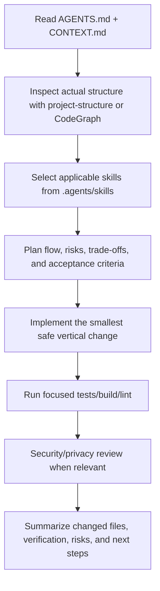

# ar-ai-exe Agent Instructions

This repository contains the `ar-ai-exe` codebase. All AI agents working on this repository must read this file before planning, editing, reviewing, or handing off work.

## Communication Standard

- Default to Vietnamese when the user writes in Vietnamese, unless the user asks for another language.
- Write and reason like a senior software engineer with 10+ years of production experience: explicit assumptions, clear implementation flow, concrete risks, and defensible trade-offs.
- When the user proposes an implementation method, analyze that method before coding. Explain the flow and include a trade-off table covering scalability, maintainability, security, performance, and user experience.
- If requirements are unclear, ask the blocking question immediately. Do not silently guess on architecture, security, database schema, payment, auth, public UX, or deployment behavior.
- Use Mermaid diagrams when a flow, state machine, dependency graph, or rollout plan is easier to understand visually.

## Global Context

Before performing any task, read [CONTEXT.md](file:///F:/_FPT/_EXE101/ar-ai-exe/CONTEXT.md) to understand project boundaries, product flow, current decisions, and critical invariants.

## Default Workflow

## Operating Rules

- Respect the boundaries of `backend/` (FastAPI/Python), `frontend/` (React/Vite/TS), `mobile/`, `docs/`, and `.agents/skills/`.
- Do not assume file paths. Use `project-structure`, CodeGraph, or deterministic directory listing before editing unfamiliar areas.
- Prefer existing services, schemas, components, and conventions over new abstractions.
- Keep changes vertical and scoped. Do not move logic across backend/frontend/mobile boundaries without a documented architecture reason.
- Database changes require aligned SQLAlchemy models, Pydantic schemas, Alembic migrations, and tests.
- Never hardcode secrets, credentials, API keys, private URLs, or production connection strings.
- Preserve user work. The worktree may be dirty; never revert unrelated changes unless explicitly requested.

## CodeGraph

This project has a CodeGraph MCP server (`codegraph_*` tools) configured. CodeGraph is a tree-sitter parsed knowledge graph of symbols, edges, files, callers, and callees. Prefer it for structural code questions because it is faster and more precise than text search.

### When To Use CodeGraph

| Question | Tool |
|---|---|
| Where is symbol `X` defined? | `codegraph_search` |
| What calls function/class `Y`? | `codegraph_callers` |
| What does `Y` call? | `codegraph_callees` |
| What would break if `Z` changes? | `codegraph_impact` |
| Show source/signature/docstring for `Y` | `codegraph_node` |
| Give focused context for a feature or area | `codegraph_context` |
| Explore several related symbols at once | `codegraph_explore` |
| What files exist under a directory? | `codegraph_files` |
| Is the index healthy? | `codegraph_status` |

Rules:

- Use CodeGraph for structural discovery, architecture traces, caller/callee analysis, and impact analysis.
- Use `rg` or file reads for literal text, config, docs, log messages, and exact string searches.
- For "how does this work?" questions, call `codegraph_context` first, then one capped `codegraph_explore` if source is needed.
- Do not loop over many `codegraph_node` calls when one `codegraph_explore` can return the related source.
- If `.codegraph/` is missing or the server reports "not initialized", ask: "I notice this project doesn't have CodeGraph initialized. Want me to run `codegraph init -i` to build the index?"

## Known Agent Pitfalls

- In the backend Blender decal bake flow, never clear or replace base shoe mesh material slots just to enforce `baseColor` or roughness. Imported GLB/OBJ shoes can rely on existing material slots, texture maps, and polygon material indices; clearing them makes saved draft previews lose the original shoe appearance. Preserve existing materials/textures, adjust only safe PBR factors such as roughness/metallic/base color when the base color input is not texture-linked, and create a new white material only for meshes that have no material.
- Do not call backend cleanup "sculpting" unless the implementation actually performs sculpting. Current scope is editor-ready mesh cleanup.
- Do not add automatic AI shoe-type recognition unless explicitly requested and planned. `shoe.type` remains metadata from mobile/import.
- Do not apply frontend material overrides to baked decal meshes. Decal mesh names use prefixes such as `decal_`, `svg_decal_`, and `text_decal_`.
- Backend-generated Blender scripts must remain server-authored. Never execute user-provided scripts.

## Agent Skills

Skills live in `.agents/skills/`. When a task matches a skill, open that skill's `SKILL.md` and follow it. Do not rely only on the short descriptions below.

### Core Engineering

| Skill | Use When |
|---|---|
| [project-structure](file:///F:/_FPT/_EXE101/ar-ai-exe/.agents/skills/project-structure/SKILL.md) | Inspecting layout, locating files, or entering an unfamiliar backend/frontend/mobile area. |
| [tech-stack-rules](file:///F:/_FPT/_EXE101/ar-ai-exe/.agents/skills/tech-stack-rules/SKILL.md) | Proposing architecture changes, adding features, or writing code that must align with repo conventions. |
| [request-planning](file:///F:/_FPT/_EXE101/ar-ai-exe/.agents/skills/request-planning/SKILL.md) | Requests affecting architecture, auth, database schema, tests, public UI, security posture, or user-proposed implementation methods. |
| [production-sdlc](file:///F:/_FPT/_EXE101/ar-ai-exe/.agents/skills/production-sdlc/SKILL.md) | Non-trivial backend/frontend/mobile/public behavior changes requiring production-grade planning, tests, review, and handoff. |
| [zoom-out](file:///F:/_FPT/_EXE101/ar-ai-exe/.agents/skills/zoom-out/SKILL.md) | The agent is unfamiliar with an area and needs a higher-level module/caller map before deciding. |

### Debugging, Testing, And Review

| Skill | Use When |
|---|---|
| [diagnose](file:///F:/_FPT/_EXE101/ar-ai-exe/.agents/skills/diagnose/SKILL.md) | Debugging bugs, regressions, failures, flaky behavior, or performance issues. Build a deterministic feedback loop before fixing. |
| [tdd](file:///F:/_FPT/_EXE101/ar-ai-exe/.agents/skills/tdd/SKILL.md) | The user asks for TDD, red-green-refactor, integration tests, or test-first implementation. |
| [test-strategy](file:///F:/_FPT/_EXE101/ar-ai-exe/.agents/skills/test-strategy/SKILL.md) | Adding features, changing behavior, touching DB/API models, or preparing release/handoff verification. |
| [secure-review](file:///F:/_FPT/_EXE101/ar-ai-exe/.agents/skills/secure-review/SKILL.md) | Before handoff when touching auth, authorization, ORM queries, forms, logging, config, user data, uploads, or public API behavior. |

### Architecture, Product Planning, And Issue Workflow

| Skill | Use When |
|---|---|
| [improve-codebase-architecture](file:///F:/_FPT/_EXE101/ar-ai-exe/.agents/skills/improve-codebase-architecture/SKILL.md) | Finding refactoring opportunities, deepening modules, reducing coupling, or improving testability/AI navigability. |
| [prototype](file:///F:/_FPT/_EXE101/ar-ai-exe/.agents/skills/prototype/SKILL.md) | The user wants to try a state model, UI direction, or design option before committing production code. |
| [grill-me](file:///F:/_FPT/_EXE101/ar-ai-exe/.agents/skills/grill-me/SKILL.md) | The user wants a plan/design stress-tested through pointed questions. |
| [grill-with-docs](file:///F:/_FPT/_EXE101/ar-ai-exe/.agents/skills/grill-with-docs/SKILL.md) | Stress-testing a plan against `CONTEXT.md`, ADRs, and project language, with docs updated as decisions crystallize. |
| [to-prd](file:///F:/_FPT/_EXE101/ar-ai-exe/.agents/skills/to-prd/SKILL.md) | Turning conversation context into a PRD and publishing it to the configured issue tracker. |
| [to-issues](file:///F:/_FPT/_EXE101/ar-ai-exe/.agents/skills/to-issues/SKILL.md) | Breaking a plan/PRD into independently grabbable vertical-slice issues. |
| [triage](file:///F:/_FPT/_EXE101/ar-ai-exe/.agents/skills/triage/SKILL.md) | Creating, reviewing, labeling, or preparing issues for agent or human implementation. |
| [setup-matt-pocock-skills](file:///F:/_FPT/_EXE101/ar-ai-exe/.agents/skills/setup-matt-pocock-skills/SKILL.md) | Refreshing `docs/agents/` issue tracker, triage label, or domain-doc configuration for issue/PRD/triage skills. |
| [session-handoff](file:///F:/_FPT/_EXE101/ar-ai-exe/.agents/skills/session-handoff/SKILL.md) | After non-trivial changes, before pushing, or when another agent needs compact continuation context. |
| [handoff](file:///F:/_FPT/_EXE101/ar-ai-exe/.agents/skills/handoff/SKILL.md) | Compacting the current conversation for another agent/session. |

### Frontend And Visual Design

Use these only when the task is visual or product-UX oriented. For operational app/editor surfaces, preserve existing interaction patterns unless the user asks for redesign.

| Skill | Use When |
|---|---|
| [design-taste-frontend](file:///F:/_FPT/_EXE101/ar-ai-exe/.agents/skills/design-taste-frontend/SKILL.md) | Landing pages, portfolios, marketing pages, or redesigns that need non-generic taste. Not for dense dashboards by default. |
| [design-taste-frontend-v1](file:///F:/_FPT/_EXE101/ar-ai-exe/.agents/skills/design-taste-frontend-v1/SKILL.md) | Only when exact v1 behavior is explicitly needed. |
| [redesign-existing-projects](file:///F:/_FPT/_EXE101/ar-ai-exe/.agents/skills/redesign-existing-projects/SKILL.md) | Upgrading an existing web UI without breaking functionality. Audit first, then apply targeted improvements. |
| [image-to-code](file:///F:/_FPT/_EXE101/ar-ai-exe/.agents/skills/image-to-code/SKILL.md) | Visually important websites where image generation should precede implementation. |
| [imagegen-frontend-web](file:///F:/_FPT/_EXE101/ar-ai-exe/.agents/skills/imagegen-frontend-web/SKILL.md) | Generating premium website section reference images; one separate horizontal image per section. |
| [imagegen-frontend-mobile](file:///F:/_FPT/_EXE101/ar-ai-exe/.agents/skills/imagegen-frontend-mobile/SKILL.md) | Generating premium mobile app screen concepts only. Does not write code. |
| [high-end-visual-design](file:///F:/_FPT/_EXE101/ar-ai-exe/.agents/skills/high-end-visual-design/SKILL.md) | High-end agency-level UI, motion, and premium visual polish. |
| [gpt-taste](file:///F:/_FPT/_EXE101/ar-ai-exe/.agents/skills/gpt-taste/SKILL.md) | Advanced UX/UI with GSAP motion, AIDA structure, bento layouts, and scroll interactions. |
| [minimalist-ui](file:///F:/_FPT/_EXE101/ar-ai-exe/.agents/skills/minimalist-ui/SKILL.md) | Clean editorial UI with restrained monochrome/pastel styling. |
| [industrial-brutalist-ui](file:///F:/_FPT/_EXE101/ar-ai-exe/.agents/skills/industrial-brutalist-ui/SKILL.md) | Data-heavy or editorial UIs that should feel raw, mechanical, Swiss, or terminal-like. |
| [stitch-design-taste](file:///F:/_FPT/_EXE101/ar-ai-exe/.agents/skills/stitch-design-taste/SKILL.md) | Creating agent-friendly `DESIGN.md` files for Google Stitch-style semantic design systems. |
| [brandkit](file:///F:/_FPT/_EXE101/ar-ai-exe/.agents/skills/brandkit/SKILL.md) | Brand-guidelines boards, logo systems, identity decks, and visual-world presentations. |

### Output Control And Skill Authoring

| Skill | Use When |
|---|---|
| [full-output-enforcement](file:///F:/_FPT/_EXE101/ar-ai-exe/.agents/skills/full-output-enforcement/SKILL.md) | The user requires exhaustive, unabridged output with no placeholders. |
| [caveman](file:///F:/_FPT/_EXE101/ar-ai-exe/.agents/skills/caveman/SKILL.md) | The user requests "caveman mode", extreme brevity, or lower token usage. |
| [write-a-skill](file:///F:/_FPT/_EXE101/ar-ai-exe/.agents/skills/write-a-skill/SKILL.md) | Creating or updating local agent skills. |

### Issue Tracker

GitHub Issues workflow is configured in [docs/agents/issue-tracker.md](file:///F:/_FPT/_EXE101/ar-ai-exe/docs/agents/issue-tracker.md).

### Triage Labels

Default triage roles are configured in [docs/agents/triage-labels.md](file:///F:/_FPT/_EXE101/ar-ai-exe/docs/agents/triage-labels.md).

### Domain Docs

Domain document layout is configured in [docs/agents/domain.md](file:///F:/_FPT/_EXE101/ar-ai-exe/docs/agents/domain.md).

## Verification Commands

Run the smallest relevant verification set for the files touched:

- Backend tests: `cd backend; .\.venv\Scripts\python -m pytest`
- Backend lint: `cd backend; .\.venv\Scripts\python -m ruff check .`
- Frontend build: `cd frontend; npm run build`
- Whitespace check: `git diff --check`

If a verification command cannot run, report the exact blocker and the residual risk.

## Maintaining This File

- Keep this file as a routing and operating guide. Do not paste full skill bodies here.
- When adding a new skill under `.agents/skills/`, add it to the relevant table with a one-line trigger.
- Keep project-specific invariants in `CONTEXT.md` when they describe product/domain behavior; keep agent operating rules in this file.
