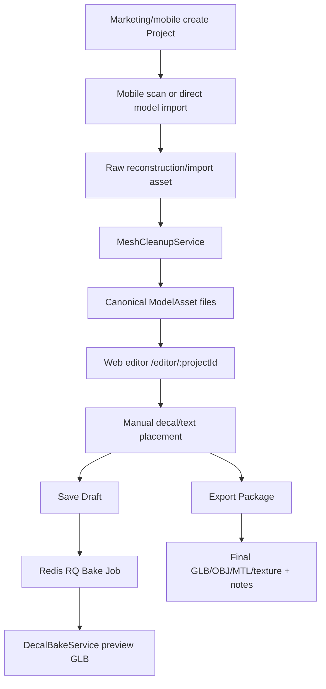

# ar-ai-exe Domain Context

`ar-ai-exe` is a shoe scan/import and web customization system. Users open a backend-owned project from marketing, mobile, or legacy scan/import flows; the backend normalizes shoe models into editor-ready assets, the web editor lets users manually place sticker/text decals, and the backend bakes draft previews/export packages.

This file is the first project context AI agents should read before touching code. Keep it factual and aligned with the current repository state.

## Architecture Boundaries

- **`backend/`**: FastAPI API server, SQLAlchemy models, Alembic migrations, storage services, reconstruction/import pipelines, mesh cleanup, design assets, decal baking, and export package generation.
- **`frontend/`**: React/Vite/TypeScript web editor for loading model assets, placing sticker/text layers, saving draft previews, and downloading reconstruction/export files.
- **`desktop/`**: Tauri desktop shell that builds and packages the existing `frontend/` editor. It must not fork editor business logic; desktop-specific behavior should stay limited to packaging, launch routing, and native shell integration.
- **`mobile/`**: Mobile capture/import entry point. Keep mobile scan metadata and upload concerns isolated from the web editor.
- **`docs/`**: Agent, issue tracker, ADR, and domain documentation.
- **`.agents/skills/`**: Local workflow instructions agents should follow for planning, testing, security review, and handoff.

## Product Flow

## Backend Domain Map

- **Scan/reconstruction**: `ReconstructionService` orchestrates frame extraction/reconstruction when real toolchain support is available. It uses COLMAP/OpenMVS concepts and delegates editor-ready mesh cleanup after reconstruction.
- **Model import**: `ModelImportService` accepts GLB/OBJ uploads and produces the same canonical model asset surface used by scan outputs.
- **Mesh cleanup**: `MeshCleanupService` runs a server-generated Blender background script to normalize origin/scale/orientation, remove helper objects, repair basic mesh state, preserve materials/textures, and report editor-readiness. This is editor-ready cleanup, not production retopology or true sculpting.
- **Model assets**: `ModelAssetService` exposes canonical files for the web editor and download buttons. Expected canonical names include `shoe_preview.glb`, `shoe.obj`, `shoe.mtl`, and `shoe_texture.png`.
- **Design assets**: `DesignAssetService` stores uploaded/canvas/text-render sticker imagery and resolves payloads during bake/export.
- **Design drafts**: `DesignService` stores design config JSON and marks preview state; queued workers refresh baked preview GLBs when decals exist.
- **Projects**: `ProjectService` owns the external integration boundary for marketing/mobile/editor. The editor route receives only `projectId`, then loads `EditorContext` from `/api/projects/{projectId}/editor-context`.
- **Jobs**: `JobService` enqueues preview bake work through Redis RQ. API save endpoints persist drafts quickly; the worker updates `Job` and `Design.previewStatus`.
- **Customization target handling**: `customization_zones.py` no longer enforces strict allow/block shoe-zone names. Decal/text target names are accepted when present, missing targets are allowed, and bake falls back to base shoe meshes while still excluding generated decal meshes.
- **Decal bake/export**: `DecalBakeService` uses Blender background mode (`apply_decals.py`) to project decal meshes onto the shoe surface and writes `final_shoe.glb`, `final_shoe.obj`, and `final_shoe.mtl`. `ExportPackageService` packages final model files, notes, previews, and config.

## Frontend Domain Map

- **Main app state**: `frontend/src/App.tsx` owns loaded scan/model/design state, saved preview state, fixed material normalization, and save/export workflows.
- **3D viewer**: `frontend/src/components/ModelViewer/ModelViewer.tsx` loads GLB assets, computes bounds, offers surface snapping across base model meshes, renders transform controls, and hides already baked layers when showing a baked preview GLB.
- **Editor panels**: `frontend/src/components/Editor/EditorPanels.tsx` owns design controls, layer list, preset/upload/canvas sticker input, save/export actions, and reconstruction file download buttons.
- **Artwork editor**: `ArtworkCanvasEditor` creates editable sticker artwork before upload/bake.
- **Sticker presets**: `frontend/src/data/stickerPresets.ts` contains local preset decal metadata.
- **Customization target filtering**: `frontend/src/utils/customizationZones.ts` excludes generated decal meshes from snapping targets but does not enforce strict shoe-zone allow/block terms.
- **Desktop launcher**: The desktop shell opens the same editor code with `?desktop=1`; the lightweight launcher accepts a Project ID or web editor URL and then loads the existing project editor context.

## Current Product Decisions

- Shoe type recognition is not automatic in this phase. `shoe.type` comes from mobile/import metadata (`sneaker | running | boot | sandal | other`) and must not drive geometry-critical behavior.
- Backend cleanup is deterministic and shared by scan + import. It targets editor ergonomics: stable scale, origin, orientation, bounds, and basic mesh validity.
- The editor material baseline is fixed: `baseColor = #ffffff`, `roughness = 1`, `metallic = 0`. Users should not get UI controls to edit base color or roughness in the current MVP.
- Decal placement is manual. Users position sticker/text layers in the web editor; backend bake/export converts them into preview/export geometry.
- Existing model textures/materials matter. Imported shoes may rely on texture maps, material slots, and polygon material indices to remain visually correct.

## Critical Invariants

- **Do not call backend cleanup "sculpting"** unless the implementation actually performs sculpting. Current scope is editor-ready mesh cleanup.
- **Do not add AI shoe-type inference** unless explicitly requested and planned. Metadata remains user-provided.
- **Preserve original shoe materials/slots during bake**: In `decal_baker.py` / `apply_decals.py`, do not clear, re-create, or replace material slots or texture mappings of base meshes. Only update the PBR properties (`Base Color`, `Roughness`, `Metallic`) of existing materials if they are not texture-linked (i.e. do not have links on their input nodes). Create a new solid color material only for meshes that have no material.
- **Decal Raycast Hit Ratio Check**: The Blender script projects decal vertices to the target mesh using BVHTree and directional raycasting. At least 25% of the decal vertices must successfully hit/project onto the shoe surface (`hit_ratio >= 0.25`), otherwise the bake fails with a missed surface error. This prevents decals floating in space.
- **Decal Limits**:
  - Maximum decal layers per design: 50.
  - Text length limit: 80 characters.
  - Custom sticker file size: 5 MB maximum.
  - Sticker images must be embedded PNG, JPEG, or SVG data URIs, or registered design assets (via `assetId`). Local browser blob URLs (`blob:...`) must never be sent to the backend as they are inaccessible.
- **Do not apply frontend material overrides to baked decal meshes**: Decal mesh names use prefixes such as `decal_`, `svg_decal_`, and `text_decal_` to distinguish them from customizable shoe meshes.
- **Preview GLB URLs must avoid browser cache**: Preview URLs are stable per design, so frontend preview fetches should use cache-busting queries when a draft is saved again.
- **Keep backend-generated Blender scripts server-authored**: Never execute user-provided scripts.
- **Keep scan/import canonical output backward-compatible** so existing editor/download code can keep loading GLB/OBJ/MTL/texture files.

## Verification Commands

Run these from the indicated directories when touching the related subsystem:

- Backend tests: `cd backend; .\.venv\Scripts\python -m pytest`
- Backend lint: `cd backend; .\.venv\Scripts\python -m ruff check .`
- Frontend build: `cd frontend; npm run build`
- Desktop frontend build: `cd frontend; npm run build -- --mode desktop`
- Desktop package build: `cd desktop; npm install; npm run build` (requires Rust/Cargo and Tauri platform prerequisites)
- Whitespace check: `git diff --check`

Blender-dependent bake/reconstruction smoke tests require `blender` to be available in PATH or configured through `BLENDER_BIN`.

## AI Agent Guidelines

1. **Read this file first** before proposing or implementing project changes.
2. **Use skills** from `.agents/skills/` for planning, project structure inspection, test strategy, security review, and handoff.
3. **Respect boundaries** between backend, frontend, mobile, and docs. Do not move logic across subsystems without an explicit architecture reason.
4. **Database changes require Alembic**. Keep SQLAlchemy models, schemas, and migrations aligned.
5. **Preserve user work**. The worktree may be dirty; never revert unrelated changes unless explicitly requested.
6. **Prefer existing services and patterns** over new abstractions. Add abstractions only when they remove real duplication or clarify a shared boundary.
