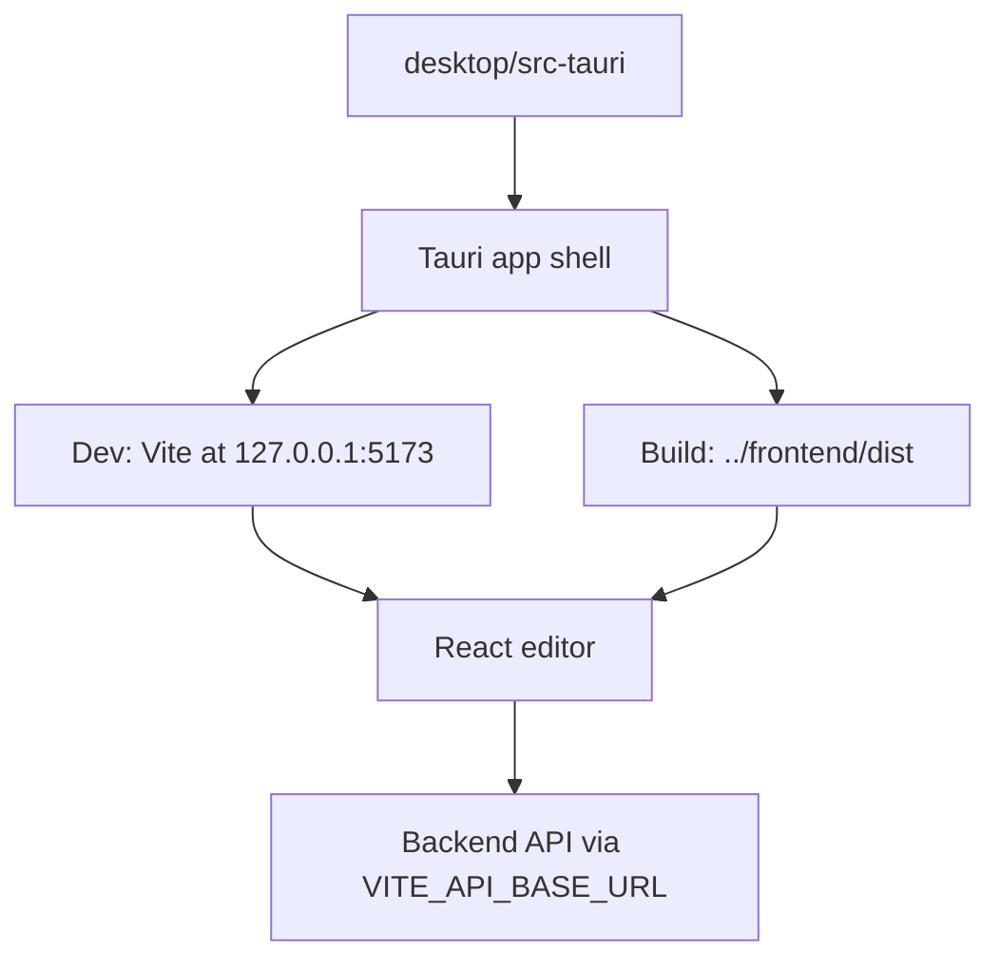

# KusShoes Desktop Editor

This folder contains the Tauri desktop shell for the existing KusShoes web editor.
The desktop app does not fork editor logic; it builds and packages `../frontend`.

## Architecture



## Prerequisites

- Node.js 20 or newer.
- Rust stable toolchain.
- Platform WebView runtime. Windows uses Microsoft Edge WebView2.
- Backend API, Redis, and worker running when save/bake/export is needed.

## Environment

Create `frontend/.env.desktop` from the example in this folder:

```powershell
Copy-Item desktop\frontend.env.desktop.example frontend\.env.desktop
```

For local development, keep:

```env
VITE_API_BASE_URL=http://127.0.0.1:8000
VITE_MARKETING_LOGIN_URL=http://127.0.0.1:5174/login
VITE_DESKTOP_SHELL=true
VITE_DESKTOP_DEMO_PROJECT_ID=proj_desktop_demo
```

For staging or production builds, replace `VITE_API_BASE_URL` and
`VITE_MARKETING_LOGIN_URL` with the target environment URLs before packaging.
Do not put secrets in these files; Vite variables are bundled into the app.

## Development

```powershell
cd desktop
npm install
npm run dev
```

`npm run dev` starts the existing frontend Vite server and launches the Tauri
window with `?desktop=1`. The desktop launcher accepts either:

- a raw project id such as `proj_...`
- a web editor URL such as `https://app.example.com/editor/proj_...`
- the configured demo project button when `VITE_DESKTOP_DEMO_PROJECT_ID` is set

After a project is selected, the app loads the same editor context endpoint used
by the web editor.

## Seed Demo Project

The local desktop demo uses this deterministic project id:

```text
proj_desktop_demo
```

Seed it from the bundled sample model:

```powershell
cd backend
.\.venv\Scripts\python -m app.scripts.seed_desktop_demo_project --model ..\data\3DModel.glb
```

Then run the backend and desktop app. In the desktop launcher, click **Open Demo
Project**. The button logs in with the backend demo account and opens the seeded
project.

On Windows, if Application Control blocks the generated debug executable after a
successful compile, unblock the generated file and run it again while the Vite
server is still running:

```powershell
Unblock-File .\src-tauri\target\debug\kusshoes-editor-desktop.exe
.\src-tauri\target\debug\kusshoes-editor-desktop.exe
```

## Build

```powershell
cd desktop
npm install
npm run build
```

The build command runs the frontend build in desktop mode and packages
`frontend/dist` through Tauri.

## Auth Notes

The desktop app keeps the current backend contract:

- Cookie auth works when the marketing login flow can redirect back to the
  desktop WebView URL.
- Bearer fallback still works for mobile/demo flows because the shared frontend
  API client has not been forked.
- Marketing should allow desktop redirect URLs before production desktop login
  is enabled.

## Current Scope

This is a packaging shell for the existing editor. It intentionally does not add:

- offline backend behavior
- local project database
- native file import/export dialogs
- custom deep links such as `kusshoes://editor/{projectId}`

Those should be planned separately because they affect auth, permissions, and
desktop operating-system integration.
