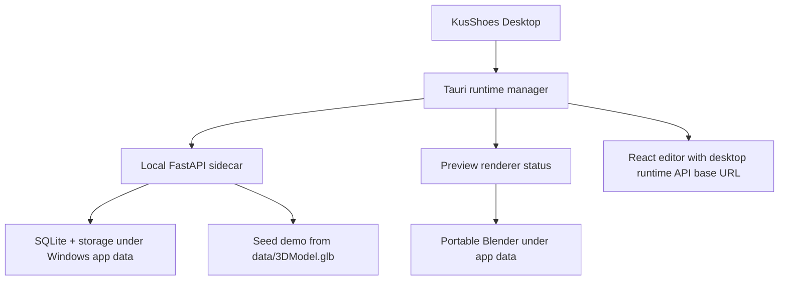

# KusShoes Desktop Editor

This folder contains the Windows-first Tauri beta shell for the existing
KusShoes web editor. The desktop app does not fork editor logic; it packages
`../frontend` and starts a local FastAPI backend sidecar.

## Beta Scope

- External tester flow: install, open app, open demo project, edit stickers/text,
  save draft, bake preview, export.
- No Docker, Redis, terminal, COLMAP, OpenMVS, or scan-video reconstruction in
  the desktop beta.
- Blender is the only heavyweight runtime dependency. It is used for import
  cleanup, preview bake, and export.



## Runtime Data

Desktop runtime data is outside the repo:

```text
%LOCALAPPDATA%\KusShoes Editor\
  runtime\logs\
  runtime\tools\blender\
  storage\app.db
  storage\models\
  storage\designs\
  storage\exports\
```

The backend sidecar sets desktop defaults:

```env
ENVIRONMENT=desktop
DATABASE_AUTO_CREATE_TABLES=true
ENABLE_INLINE_BAKE_FALLBACK=true
ENABLE_REAL_RECONSTRUCTION=false
AUTH_COOKIE_SECURE=false
```

## Development

Prerequisites for developers:

- Node.js 20 or newer.
- Rust stable toolchain.
- Python backend `.venv` already set up.
- Microsoft Edge WebView2 runtime on Windows.

Run the desktop shell:

```powershell
cd desktop
npm install
npm run dev
```

In development, if no packaged sidecar exists, the Tauri runtime manager starts:

```powershell
backend\.venv\Scripts\python.exe -m app.desktop_entrypoint
```

The first screen opens with `?desktop=1`, starts the local backend, seeds
`proj_desktop_demo` from `data/3DModel.glb`, and shows:

- Open demo project
- Open project URL / project id
- Import GLB/OBJ
- Diagnostics actions

## Preview Renderer Manifest

The dependency manifest lives at:

```text
desktop/dependencies/blender.windows.json
```

Before a release build, replace the placeholder `sha256` with the official
checksum for the configured Blender archive. The installer refuses to download
when the checksum is missing; this is intentional fail-safe behavior.

## Build Backend Sidecar

Build the Windows sidecar executable into `desktop/sidecars/`:

```powershell
powershell -ExecutionPolicy Bypass -File .\desktop\scripts\build-backend-sidecar.ps1
```

The script expects PyInstaller to be available in `backend\.venv`. If it is not
installed, install it in the backend virtual environment first:

```powershell
cd backend
.\.venv\Scripts\python -m pip install pyinstaller
```

Generated sidecar binaries are ignored by git. Tauri bundles
`desktop/sidecars/*` when files are present.

## Build Desktop App

```powershell
cd desktop
npm install
npm run build
```

The Tauri build packages `frontend/dist`, `desktop/dependencies/*`,
`desktop/sidecars/*`, and `data/3DModel.glb`.

## Diagnostics

The app exposes runtime commands for:

- backend status and selected local port
- Blender install status and path
- storage/log paths
- copy diagnostics
- open logs folder
- restart backend

Primary UI messages stay user-friendly. Technical command output is written to
runtime logs for testers to send to the team.

## Current Limitations

- The first-run Blender download is disabled until the release manifest has a
  real SHA-256 checksum.
- Import GLB/OBJ requires the Preview renderer because the backend normalizes
  imported models through Blender.
- The beta is Windows-first. macOS/Linux packaging should be planned
  separately.
