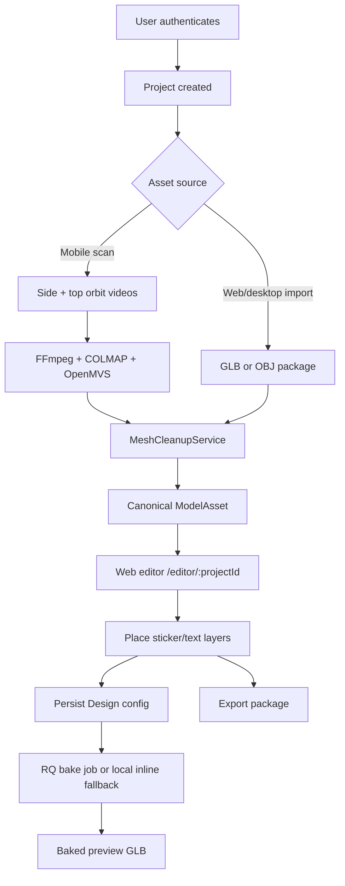

# Project Overview

## Documentation scope

The executable product repository documented here is `ar-ai-exe`. The current workspace also contains a separate sibling repository, `../Connect Web to Deskop/KusShoes`, which implements the KusShoes marketing/portal prototype. It is **not** a folder in this monorepo and is not built by this repository's Docker or CI workflows. Its `LOCAL_SETUP_GUIDE.md` and `AI_AGENT_SETUP_INSTRUCTIONS.md` describe it as the marketing frontend on `localhost:5173`, with this repository's FastAPI API on `localhost:8000` and editor on `localhost:5180`. In its current code, however, `KusShoes/src/App.tsx` uses in-memory projects and simulated authentication, while `KusShoes/src/api/client.ts` is not imported by the active UI. Treat that companion as an integration prototype, not an authoritative system of record.

All implementation-status claims below are based on executable code, migrations, Compose files, and workflows in `ar-ai-exe`; existing prose documents are supporting context rather than proof of implementation.

## Purpose

`ar-ai-exe` (product labels also use **KusShoes** and **Shoe Visual Customizer**) is a shoe-specific capture, 3D reconstruction/import, and visual customization system. It connects a guided Flutter capture client, a FastAPI asset-processing backend, a React/Three.js editor, and a Windows-first Tauri desktop shell.

The problem it solves is the discontinuity between acquiring a real shoe model and producing an editable/exportable 3D design. The backend turns either scan videos or uploaded GLB/OBJ files into a canonical asset set; the editor places image/text decals; Blender produces baked previews and export packages.

Sources: `CONTEXT.md`, `README.md`, `backend/app/services/reconstruction.py`, `backend/app/services/model_imports.py`, `frontend/src/App.tsx`.

## Product vision and implemented scope

| Capability | Current state | Evidence |
|---|---|---|
| Guided two-pass shoe capture | Implemented in mobile | `mobile/lib/screens/camera_scan_screen.dart` |
| Upload scan metadata and videos | Implemented | `mobile/lib/services/backend_api.dart`, `backend/app/api/scan_sessions.py` |
| Photogrammetry | Implemented orchestration; requires host tools | `backend/app/services/reconstruction.py`, `reconstruction_toolchain.py` |
| GLB/OBJ import | Implemented | `backend/app/api/models.py`, `services/model_imports.py` |
| Editor-ready mesh cleanup | Implemented through server-authored Blender scripts | `services/mesh_cleanup.py` |
| Web 3D editor | Implemented MVP | `frontend/src/App.tsx`, `components/ModelViewer/ModelViewer.tsx` |
| Decal/text preview bake | Implemented | `services/decal_baker.py`, `services/jobs.py` |
| Export package | Implemented synchronously | `services/export_packages.py` |
| Desktop editor | Windows-first beta; local data/backend | `desktop/src-tauri/src/main.rs`, `desktop/README.md` |
| Cross-device live synchronization | Not implemented | no revision/sync protocol exists |
| AI shoe-type recognition | Explicitly out of current scope | `CONTEXT.md` |

“AI Scan” appears in mobile UI copy, but current reconstruction is classical FFmpeg/COLMAP/OpenMVS/Blender processing. The repository does not contain an ML shoe-recognition model.

## Main user flow

Canonical model outputs are `shoe_preview.glb`, `shoe.obj`, `shoe.mtl`, `shoe_texture.png`, metadata, quality report, and an OBJ package. Existing materials and texture links are critical invariants during cleanup and bake.

## Main technologies

| Area | Technology |
|---|---|
| Backend | Python 3.11+, FastAPI, Pydantic Settings, SQLAlchemy 2, Alembic |
| Database | SQLite locally/desktop; PostgreSQL/Neon configured for production |
| Queue | Redis 7 + RQ for preview bake jobs |
| 3D processing | FFmpeg, COLMAP, OpenMVS, Blender |
| Web | React 19, TypeScript 5.9, Vite 7, Three.js, React Three Fiber/Drei |
| Mobile | Flutter/Dart, `camera`, Dio, secure storage |
| Desktop | Tauri 2/Rust, packaged React build, FastAPI sidecar, portable Blender |
| Storage | Local filesystem adapter or S3-compatible adapter |
| Edge/deployment | Docker Compose, Caddy, GitHub Actions, SonarCloud |

## Critical domain invariants

- Mesh cleanup is editor-ready cleanup, not sculpting or production retopology.
- `shoe.type` is supplied metadata, not inferred by AI.
- Bake must preserve source shoe material slots and texture mappings.
- Baked decal mesh prefixes (`decal_`, `svg_decal_`, `text_decal_`) must not receive frontend base-material overrides.
- At least 25% of decal vertices must hit the shoe surface during bake.
- A design supports at most 50 content layers; text is at most 80 characters; custom sticker payload is at most 5 MB.
- Browser `blob:` URLs are runtime-only and cannot be persisted as backend decal sources.
