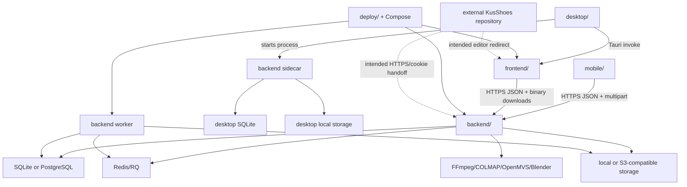

# Monorepo Structure

## Repository boundary

`ar-ai-exe` is the product monorepo described by the tree below. The separately checked-out `KusShoes` repository is a companion marketing/portal prototype, not a top-level folder. There is no package-manager workspace, Git submodule, shared build, or CI dependency connecting the two repositories. Their intended integration is HTTP/cookie based: marketing portal -> FastAPI -> editor URL. The companion's active UI has not yet wired its API client, so that integration is documented intent rather than an end-to-end implementation.

## Repository tree

Generated/native build trees are collapsed; application-owned files are expanded.

```text
ar-ai-exe/
├── .agents/skills/             Agent workflow skills
├── .github/workflows/         Backend, frontend, mobile, SonarCloud CI
├── .husky/pre-push            Local change-aware quality checks
├── backend/
│   ├── alembic/versions/      Seven database migrations
│   ├── app/
│   │   ├── api/               FastAPI route modules and auth dependency
│   │   ├── core/              Settings, security, errors, storage bootstrap
│   │   ├── db/                SQLAlchemy engine/session/base
│   │   ├── models/            ORM entities and state constants
│   │   ├── schemas/           Pydantic request/response contracts
│   │   ├── scripts/           Desktop demo project seed
│   │   ├── services/          Domain and infrastructure modules
│   │   └── workers/           RQ and reconstruction entry points
│   ├── storage/               Local runtime artifact roots (`.gitkeep` only)
│   ├── tests/                 Backend behavior tests
│   ├── Dockerfile             Full photogrammetry runtime image
│   └── Dockerfile.dev         Lightweight API development image
├── data/3DModel.glb           Bundled desktop demo source model
├── deploy/                    Caddy and environment/firewall templates
├── desktop/
│   ├── dependencies/          Blender release manifest
│   ├── scripts/               PyInstaller sidecar build
│   ├── sidecars/              Generated backend executable destination
│   └── src-tauri/             Rust runtime and Tauri configuration
├── docs/                      Existing contracts, flows, deployment guides
├── frontend/
│   ├── src/api/               HTTP and Tauri runtime adapters
│   ├── src/components/        Editor, viewer, import and layout UI
│   ├── src/data/              Local sticker presets
│   ├── src/hooks/             Project editor context loader
│   ├── src/types/             Shared client-side domain types
│   └── src/utils/             Target filtering and user-facing errors
├── mobile/
│   ├── lib/app/               Theme and tab shell
│   ├── lib/models/            Scan/readiness transport models
│   ├── lib/screens/           Auth, setup, camera, upload, result flows
│   ├── lib/services/          Backend and token adapters
│   ├── lib/widgets/           Reusable scan UI
│   └── android|ios|.../       Flutter-generated platform runners
├── scripts/                   Repository automation (Sonar issue export)
├── docker-compose.yml         Production topology
├── docker-compose.dev.yml     Local Docker development topology
├── AGENTS.md                  Agent operating rules
└── CONTEXT.md                 Current domain map and invariants
```

## Top-level responsibilities

| Folder/file | Responsibility | Depends on / consumed by |
|---|---|---|
| `backend/` | System of record, processing orchestration, artifact authorization | PostgreSQL/SQLite, Redis, filesystem/S3, 3D tools |
| `frontend/` | Browser editor and shared desktop UI | Backend HTTP interface; optional Tauri bridge |
| `mobile/` | Guided capture and upload client | Backend auth/readiness/scan interfaces |
| `desktop/` | Native runtime manager and packaging | `frontend/dist`, backend sidecar, demo GLB, Blender |
| `data/` | Desktop seed input | bundled by Tauri |
| `deploy/` | Production reverse proxy/env host setup | Docker Compose, Caddy |
| `.github/` | CI and quality automation | backend/frontend/mobile/scripts |
| `scripts/` | SonarCloud-to-GitHub automation | GitHub and SonarCloud HTTP interfaces |
| `docs/` | Human/agent operating and system documentation | repository-wide |
| `.agents/` | AI workflow instructions; not product runtime | AI assistants |

## Dependency and communication map



There is no direct mobile-to-storage, frontend-to-storage, or cloud-to-desktop synchronization interface today. All product traffic goes through FastAPI. Production backend and worker share the same Docker volume; desktop runs an independent local backend and SQLite database.

## Important cross-folder build dependencies

- `frontend/Dockerfile` is built from repository root so it can package the web application with Caddy configuration.
- Tauri executes frontend dev/build commands from `desktop/src-tauri/tauri.conf.json` and packages `frontend/dist`.
- Desktop bundles `data/3DModel.glb`, `desktop/dependencies/*`, and generated `desktop/sidecars/*`.
- `docker-compose.yml` builds the same backend image for API and RQ worker and mounts one `backend_storage` volume into both.
- `sonar-project.properties` scans backend, frontend, mobile, deployment, scripts, and workflows; it excludes generated platform/build artifacts.
