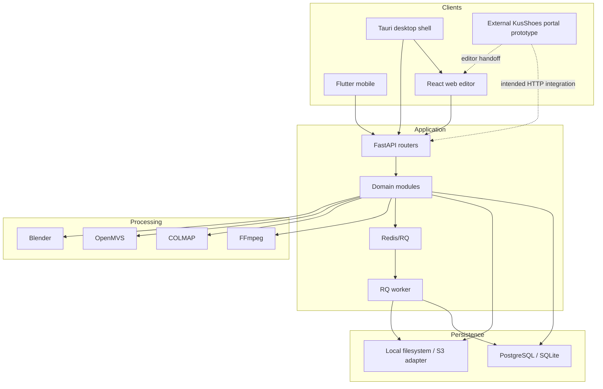
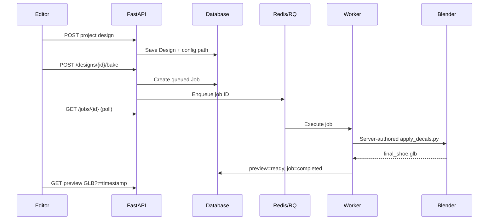

# System Architecture

## Architectural style

The repository is a modular monolith plus platform clients. FastAPI is the authoritative application and metadata interface. Heavy 3D processing is performed by local command-line tools; RQ separates preview bake execution in production. The web editor is a client-rendered SPA. Mobile is capture-only. Desktop is a local deployment of the same editor and backend rather than a cloud-synchronized client.

The sibling `KusShoes` marketing/portal prototype is outside this deployment boundary. Its desired handoff is authenticated navigation into `/editor/{projectId}`, but its current login and project screens are simulated and do not yet create or load the backend-owned aggregates described here.

## Frontend runtime

The SPA does not use a routing library. `App.tsx` derives modes from `window.location`:

- `/editor/{projectId}`: backend-owned project editor.
- `?projectId=...&desktop=1`: desktop project editor.
- legacy/default mode: authentication, scan lookup, and direct model import.

`useEditorContext` authenticates and loads `/api/projects/{id}/editor-context`. `ModelViewer` loads GLB blobs, finds base meshes, computes bounds, performs raycasting/surface snapping, and renders sticker/text planes. Save persists a design, enqueues bake, polls the job, reloads the design, and cache-busts the preview GLB.

## Backend runtime

Routers validate transport contracts and delegate to modules under `app/services`. SQLAlchemy persists metadata; storage adapters persist bytes. Scan reconstruction currently runs as a FastAPI `BackgroundTasks` task. Preview bake runs through Redis/RQ, with an inline fallback in local/dev/demo/desktop/test environments. Export creation is synchronous in the request.

## Mobile runtime

Flutter collects typed shoe, measurement, lighting/background, and customization-goal metadata. It records two videos sequentially, creates a scan session, uploads each pass as multipart data, and requests processing. Tokens are stored in secure storage on native platforms and browser local storage for Flutter web.

## Desktop runtime

Tauri loads the same compiled frontend and exposes four commands: runtime discovery, backend restart, Blender installation, and opening diagnostics. It starts a packaged PyInstaller sidecar or a development Python entrypoint on a loopback port. The sidecar uses local SQLite and app-data storage, disables reconstruction, enables inline bake fallback, and seeds a demo project.

## Storage and database

- Database contains identities, ownership, state, artifact keys, sizes, content types, and checksums—not large blobs.
- `LocalStorageService` stores keys beneath `STORAGE_ROOT` and prevents path escape.
- `S3StorageService` provides put/get/head/presigned URL operations.
- Most download responses still proxy bytes through FastAPI.
- Blender/COLMAP/OpenMVS require local paths; reconstruction explicitly calls `storage.local_path`, which means the S3 adapter is not sufficient for the complete processing pipeline without staging.

## Workers and external services

| Dependency | Role | Required where |
|---|---|---|
| Redis/RQ | Preview bake queue | production API + worker |
| Neon/PostgreSQL | production relational persistence | production |
| S3-compatible object store | optional artifact adapter | configured but not full-pipeline-ready |
| FFmpeg | frame extraction/probing | scan reconstruction |
| COLMAP | sparse photogrammetry | scan reconstruction |
| OpenMVS | dense mesh/texture | scan reconstruction |
| Blender | cleanup, canonical export, decal bake | backend/worker/desktop |
| Caddy | TLS, static web, reverse proxy | production Compose |
| GitHub/SonarCloud | CI and issue automation | engineering workflow |

## Reliability characteristics

- Preview jobs are durable in the database and RQ but have no documented retry/idempotency policy.
- Reconstruction uses process-local `BackgroundTasks`, not RQ; process restarts can interrupt work.
- Export generation blocks the request and is not represented by `Job`.
- API and worker require shared artifact visibility in the current production topology.
- Desktop state is local and isolated from production cloud state.
