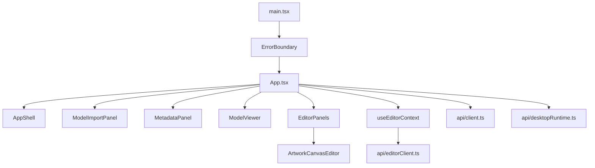
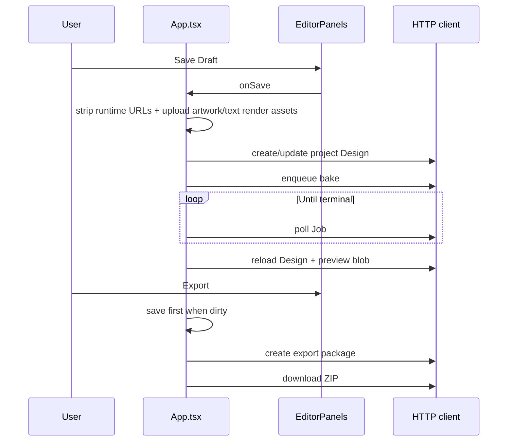

# Frontend Architecture

## Frontend boundary

This chapter describes `ar-ai-exe/frontend`, the actual 3D editor shared by browser and Tauri. It must not be confused with the sibling `KusShoes/src/pages/*` marketing/portal React application. The two builds have independent `package.json` files, styling systems, route implementations, and API clients. No source module is shared between them today.

## Runtime and composition

The frontend is a React 19 + TypeScript + Vite SPA. `src/main.tsx` mounts `App` inside `ErrorBoundary`; there is no Redux, context store, React Router, server-state library, or CSS framework. Styling is a single `src/styles.css` file.

## Routing

Routing is implemented with URL parsing helpers in `App.tsx`:

| Mode | Detection | Behavior |
|---|---|---|
| Project editor | `/editor/{projectId}` | Loads authenticated `EditorContext` |
| Desktop launcher | `?desktop=1` without project | Shows runtime, demo/import/open controls |
| Desktop editor | `?desktop=1&projectId={id}` | Uses local sidecar URL and project editor |
| Legacy browser flow | neither condition | Login, scan ID lookup, model import |

Project IDs are constrained client-side to `[A-Za-z0-9_-]{3,120}`. Redirect-to-login is constructed from `VITE_MARKETING_LOGIN_URL` with a return URL. Since no routing library owns navigation, the app uses `window.location.assign` and URL query/path helpers.

## State management

`App.tsx` owns the application state with `useState`, `useEffect`, `useMemo`, and refs. Important state groups are:

- runtime/auth: current user, auth form, desktop runtime/readiness;
- project/model: editor context, scan session, model asset, blob URL;
- design: configuration, active layer, name, persisted design, fingerprints;
- bake preview: job polling, preview blob URL, baked layer IDs, error state;
- export/import: busy states, messages, package and download actions.

`configFingerprint` compares serialized persisted configuration. `persistableConfig` removes runtime-only blob preview values. `normalizeFixedMaterial` enforces `#ffffff`, roughness `1`, metallic `0`. The model/design IDs are partly remembered in browser `localStorage` through `designStorageKey`.

## Main modules

| File | Responsibility |
|---|---|
| `App.tsx` | mode selection, orchestration, auth, loading, save/bake/export, desktop panels |
| `ModelViewer.tsx` | GLB scene, bounds, material normalization, raycasting, transform controls, layer rendering |
| `EditorPanels.tsx` | sticker/text creation, layer editing, artwork upload, actions |
| `ArtworkCanvasEditor.tsx` | browser canvas drawing and PNG export |
| `ModelImportPanel.tsx` | GLB/OBJ form, metadata and file validation |
| `MetadataPanel.tsx` | scan/quality/current-step summaries |
| `AppShell.tsx` | page header/user/logout shell |
| `useEditorContext.ts` | auth check followed by project context loading |
| `customizationZones.ts` | excludes generated decal meshes from target selection |
| `editorMessages.ts` | translates technical backend/runtime errors to user messages |

## 3D editor behavior

`ModelViewer` loads the model with Drei `useGLTF`, clones/configures materials, centers the model, computes grid/camera metrics, and builds raycast targets from customizable base meshes. Sticker and text layers are rendered as planes until baked. Once a baked preview GLB is shown, layer IDs represented by the bake are hidden to prevent duplicate rendering. Transform controls update position/rotation/scale and surface metadata in `DesignConfig`.

The frontend intentionally avoids applying base material overrides to meshes named with generated decal prefixes.

## API layer

There are two overlapping HTTP clients:

- `api/client.ts`: legacy/full client covering auth, readiness, scans, imports, design assets, designs, jobs, files and exports.
- `api/editorClient.ts`: narrower project-editor client covering identity, editor context, save, bake, poll, design and export.

Both add `credentials: include`, bearer tokens from local storage, and a CSRF header read from the CSRF cookie for mutating requests. `runtimeConfig.ts` makes the base URL mutable so desktop can point the SPA at its loopback sidecar. Binary model/preview downloads become object URLs; preview fetches include a timestamp query.

## Save and export flow

## Current architectural constraints

- `App.tsx` (~1,716 lines), `ModelViewer.tsx` (~879), and `EditorPanels.tsx` (~702) combine multiple concerns.
- Duplicate client implementations duplicate auth, CSRF, parsing, and errors.
- No frontend tests are present and no test script exists in `frontend/package.json`.
- No generated/shared OpenAPI client; TypeScript types can drift from Pydantic schemas.
- Object URL lifetime must be manually managed by effects.
