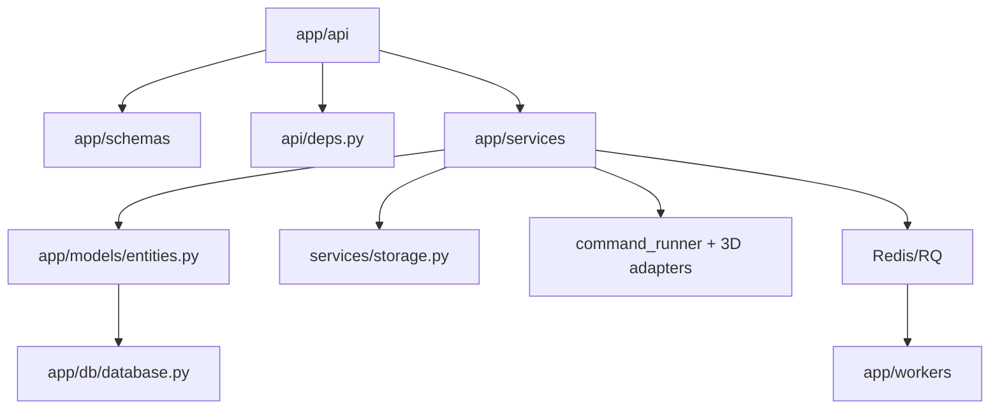
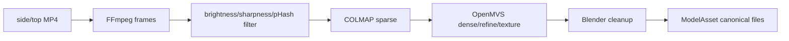

# Backend Architecture

## Framework and startup

The backend targets Python 3.11+ and uses FastAPI, Pydantic Settings, SQLAlchemy 2, Alembic, PyJWT, Argon2, Redis/RQ, and boto3. `app/main.py` creates storage directories, optionally calls `Base.metadata.create_all`, installs CORS/exception handlers, and mounts routers under `/api`.

`app/core/config.py` loads `backend/.env` and normalizes SQLite/PostgreSQL connection strings. Production should use Alembic with `DATABASE_AUTO_CREATE_TABLES=false`; desktop intentionally uses automatic table creation.

## Layer map

## API modules

| Router | Role |
|---|---|
| `auth.py` | register, login, demo login, current user, logout |
| `projects.py` | project aggregate, editor context, project design/export list |
| `scan_sessions.py` | scan lifecycle, two-pass upload, processing trigger/status |
| `models.py` | import and canonical model downloads |
| `design_assets.py` | user-owned PNG/JPEG artwork storage |
| `designs.py` | design CRUD, preview, bake, export |
| `jobs.py` | user-owned job polling |
| `exports.py` | export metadata and ZIP download |
| `system.py` | reconstruction and editor readiness |

## Authentication and authorization

Passwords are Argon2-hashed. JWT access tokens contain `sub`, `iat`, `exp`, `typ`, plus role. Login returns the token and sets an HttpOnly auth cookie plus a readable CSRF cookie. `get_current_user` prefers a bearer token; otherwise it validates cookie authentication and double-submit CSRF on mutating methods. Domain modules enforce ownership with user/project/design/job joins or IDs and generally return 404 for foreign resources.

## Database

`app/models/entities.py` contains eight ORM tables. `app/db/database.py` uses `pool_pre_ping`; PostgreSQL connections recycle after 300 seconds and SQLite disables same-thread checks. Seven sequential Alembic migrations evolve the initial schema through auth/storage metadata, two-pass scans, imports, previews, design assets, projects and jobs.

See `07_DATABASE.md` for the complete ERD.

## Domain and infrastructure modules

| Module | Responsibility |
|---|---|
| `ProjectService` | owner-scoped project interface and editor aggregate |
| `ScanSessionService` | project/session creation, metadata and video persistence, status |
| `ReconstructionService` | frames → COLMAP → OpenMVS → cleanup → canonical asset |
| `ModelImportService` | validate/stage GLB/OBJ package and converge on cleanup |
| `MeshCleanupService` | server-authored Blender normalization/export script |
| `ModelAssetService` | artifact registration, response URLs and downloads |
| `DesignAssetService` | validate and store user artwork |
| `DesignService` | config persistence and baked preview lifecycle |
| `DecalBakeService` | validate decal inputs and generate/run Blender bake script |
| `ExportPackageService` | bake/copy model files, notes, previews and ZIP |
| `JobService` | create/poll RQ bake jobs and local inline fallback |
| `ReconstructionToolchainService` | binary/resource readiness reporting |
| `EditorReadinessService` | Blender/preview capability reporting |
| `LocalStorageService`, `S3StorageService` | byte persistence adapters |
| `CommandRunner` | bounded subprocess execution and logs |

`BlenderService`, `ColmapService`, and `OpenMVSService` build/validate tool commands. Blender scripts are generated entirely by backend code.

## Reconstruction pipeline

The process endpoint checks both required uploads and host readiness, sets `queued`, then runs `process_scan_session` with FastAPI `BackgroundTasks`. This is not Redis-backed reconstruction.

## Preview worker and queue

`POST /designs/{id}/bake` creates a `jobs` row and marks the design pending. `enqueue_job` sends only the database job ID to RQ. `app.workers.job_worker.run_job` loads current state, executes `DesignService.refresh_preview`, and commits terminal status. The worker command is `python -m app.workers.rq_worker`.

When Redis is unavailable in local/dev/demo/desktop/test—or when explicitly enabled—`JobService` performs inline bake in the request process. Production returns 503 and marks the job/design failed if queueing fails.

## Storage

Storage keys and metadata are persisted in SQL. Local storage returns real paths; S3 returns none. Canonical assets are served through owner-authorized API routes even though the S3 adapter can generate signed URLs. See `08_STORAGE.md` for constraints and target architecture.

## Error interface

`app/core/errors.py` produces structured payloads with stable-ish domain/error codes for HTTP and validation failures. Client modules translate these messages to user-facing text. Errors from external tools are logged, while selected sanitized messages reach users.