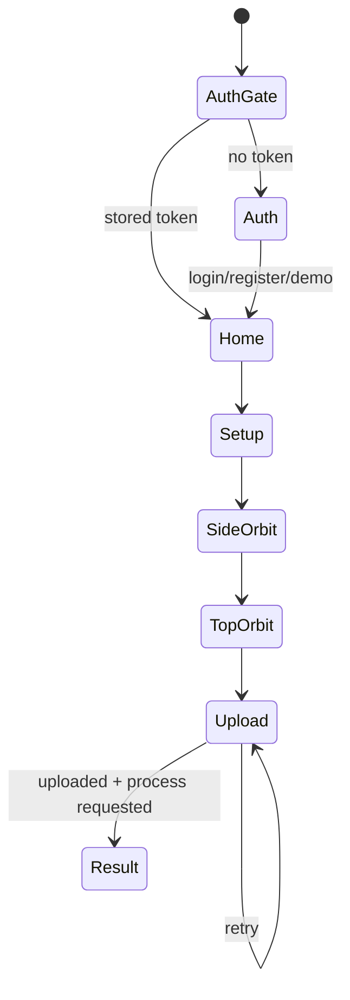
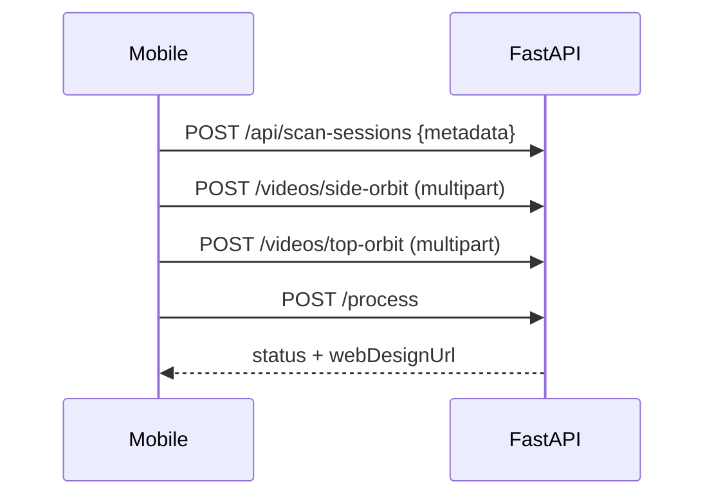

# Mobile Architecture

## Scope and modules

`mobile/` is a Flutter capture/upload client. Production-relevant scope is authentication, typed scan metadata, two guided camera passes, upload progress, readiness and reconstruction start. Explore, notifications, profile statistics, payment and community content in `app_shell.dart` are static prototype UI, not implemented backend features.

```text
mobile/lib/
├── main.dart                 MaterialApp, AuthGate, theme state
├── app/                      theme and four-tab shell
├── models/                   metadata/readiness/upload response models
├── screens/                  auth → setup → camera → upload → result
├── services/                 backend and token storage adapters
└── widgets/                  scan guidance and presentation
```

Navigation uses `Navigator` and `MaterialPageRoute`; screen-local `State` owns forms, camera, progress and errors. No shared state-management or declarative routing package is installed.

## Capture and upload flow



`camera_scan_screen.dart` uses the first camera at `ResolutionPreset.high`, disables audio and records `side-orbit` followed by `top-orbit`. Guidance asks for a level 360-degree side pass and a 30–45-degree upper pass. Code does not enforce minimum duration, blur, lighting, stabilization, frame rate or storage checks.



`UploadProgressScreen` uploads sequentially. Retry creates the flow again and can leave an earlier partial session. `BackendApi.uploadScanPass` calls `videoFile.readAsBytes()`, so a complete video is held in memory before Dio sends it.

## Authentication and communication

`BackendApi` supports register, login and demo login and adds a bearer JWT to protected requests. Token key: `shoe_customizer_access_token`.

| Platform | Token adapter |
|---|---|
| Native | `flutter_secure_storage` in `token_storage_io.dart` |
| Flutter web | browser `localStorage` in `token_storage_web.dart` |

Startup checks token presence, not `/auth/me` validity. Logout removes only the local token. Base URL comes from `--dart-define=BACKEND_BASE_URL`; its code default is development LAN address `http://172.16.1.232:8000`.

The mobile client has no scan-status polling, project list, model viewer, editor, background/resumable upload or cloud synchronization interface.

## Platforms and testing

Flutter-generated Android, iOS, web, Windows, Linux and macOS runners are tracked. Product deployment documentation targets Android. `mobile/test/widget_test.dart` provides shallow UI/platform mocks; camera, API, auth, upload recovery and navigation do not have integration tests.

Sources: `mobile/lib/main.dart`, `app/app_shell.dart`, `screens/camera_scan_screen.dart`, `screens/upload_progress_screen.dart`, `services/backend_api.dart`, `pubspec.yaml`.