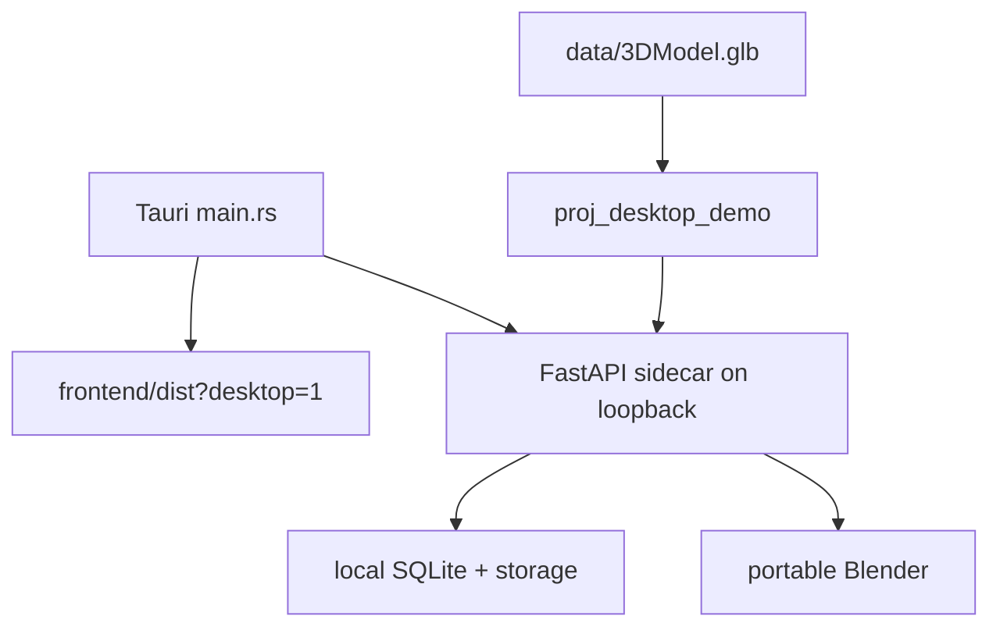

# Desktop Architecture

## Runtime

`desktop/` is a Windows-first Tauri 2 shell around the same React editor. It packages `frontend/dist`, starts a local FastAPI sidecar, stores data under app data, and manages portable Blender. It does not fork editor business logic.



Startup checks port 8000, otherwise chooses 8765–8795 and runs, in order: `KUSSHOES_BACKEND_BIN`, packaged `kusshoes-backend.exe`, or development `.venv` Python. `app.desktop_entrypoint` sets desktop storage/database/CORS, disables reconstruction, enables inline bake, and seeds the demo. React switches its API base URL to that sidecar.

## Native command interface

| Tauri command | Behavior |
|---|---|
| `get_desktop_runtime` | ensure backend and return status, ports and paths |
| `restart_backend` | stop owned child and recreate runtime |
| `install_dependency` | download, SHA-256 verify and extract Blender |
| `open_diagnostics_folder` | open log directory in Explorer |

`frontend/src/api/desktopRuntime.ts` adapts these commands and provides a browser fallback.

## Current capabilities

- Open a project ID/editor URL against the local sidecar.
- Seed/open a bundled demo.
- Import GLB/OBJ, normalize through Blender, edit stickers/text, bake and export.
- Show Blender/backend readiness, restart backend and expose diagnostics.
- Build the sidecar with PyInstaller and package all resources through Tauri.

## Runtime data

```text
%LOCALAPPDATA%/KusShoes Editor/
├── runtime/logs/
├── runtime/downloads/
├── runtime/tools/blender/
└── storage/
    ├── app.db
    ├── models/
    ├── designs/
    └── exports/
```

## Limitations and planned direction

- Desktop has an independent local database/store; no supported cloud sync exists.
- Scan reconstruction, Redis, COLMAP and OpenMVS are intentionally excluded.
- `blender.windows.json` still has a placeholder checksum, so first-run installation fails safely.
- Windows-only operations include PowerShell and Explorer; macOS/Linux need separate packaging/runtime adapters.
- CSP permits `unsafe-eval` and broad HTTPS sources and should be hardened.
- Sidecar uses `create_all`, not a packaged Alembic migration lifecycle.

The documented future is a tester-ready Windows package, then platform expansion. Cloud mode should authenticate against a cloud project, cache immutable assets locally, optionally process with local Blender, upload outputs, and resolve design revisions; none of that protocol exists today.

Sources: `desktop/src-tauri/src/main.rs`, `tauri.conf.json`, `desktop/README.md`, `backend/app/desktop_entrypoint.py`.