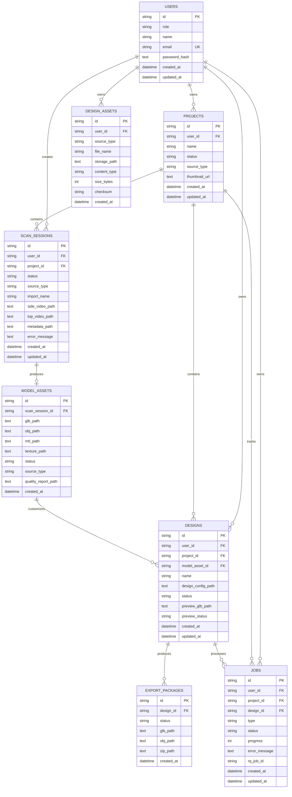

# Database Architecture

SQLAlchemy models are defined in `backend/app/models/entities.py`; seven Alembic migrations own production evolution. SQLite is the local/desktop default and PostgreSQL/Neon is the production target.

## ERD

Repeated artifact metadata columns (`*_size_bytes`, `*_content_type`, `*_checksum`) are omitted from the diagram for readability but exist for scan inputs, model files, preview GLB and export ZIP.

## Tables and relationships

| Table | Purpose | Relationships |
|---|---|---|
| `users` | identity and password credential | unique email; parent of projects, scans, designs, assets, jobs |
| `projects` | user-facing editor aggregate | required user; many scans/designs/jobs |
| `scan_sessions` | scan or synthetic import lifecycle | required user, optional project, zero/one model asset |
| `model_assets` | canonical asset metadata | exactly one unique scan session; many designs |
| `designs` | design JSON path and preview state | required user/model, optional legacy project; many exports/jobs |
| `design_assets` | uploaded/canvas/text-render artwork | required user; no project/design FK |
| `export_packages` | final files and ZIP | required design |
| `jobs` | asynchronous work record | required user; optional project/design; current type is `bake` |

## State values

| Aggregate | Values defined in code |
|---|---|
| Project | `draft`, `processing`, `ready`, `failed`, `archived` |
| Scan | `created`, `waiting_for_uploads`, `uploaded`, `queued`, processing stages, `completed`, `failed` |
| ModelAsset | `uploaded`, `processing`, `ready`, `failed` |
| Design | `draft`, `published`, `archived`, `exported` |
| Preview | `none`, `pending`, `processing`, `ready`, `failed` |
| Export | `processing`, `ready`, `completed`, `failed` |
| Job | `queued`, `processing`, `completed`, `failed` |

These are application strings, not database enum/check constraints.

## Migration history

| Revision | Change |
|---|---|
| `20260517_0001` | initial users, scans, model assets, designs, exports |
| `20260517_0002` | passwords, handoff URLs and artifact metadata |
| `20260519_0003` | two-pass scans and package metadata |
| `20260523_0004` | model import source metadata |
| `20260527_0005` | baked preview fields |
| `20260528_0006` | design assets |
| `20260612_0007` | projects, jobs, editor fields and legacy backfill |

## Constraints and debt

- Imports create synthetic `ScanSession` rows because `ModelAsset` always requires a scan session.
- `DesignAsset` has no project/design relationship, making lifecycle cleanup and quotas difficult.
- No immutable asset-version or model-lineage table exists.
- No optimistic concurrency/version field supports web/desktop simultaneous edits.
- Database-level delete behavior and retention are not defined.
- State transitions are not enforced by constraints.
- `ProjectService.latest_design()` uses `OR` between project and model filters; intended semantics should be confirmed and tested.

## Sprint 1 immutable project assets

Migration `20260702_0008` adds project-owned `asset_versions`, normalized
`asset_version_files`, and optional `asset_version_legacy_links`. Version identity is scoped by
`(project_id, asset_type, logical_key, version_number)`. `ModelAsset` remains unchanged as a
legacy compatibility projection; its optional relationship is stored outside the core version table.
