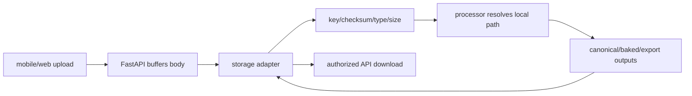
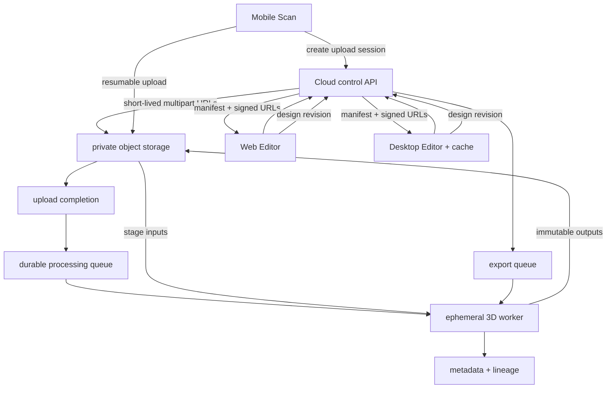

# Storage Architecture

## Current interface

`backend/app/services/storage.py` defines `put_bytes`, `get_bytes`, `exists`, `create_signed_url`, and `local_path`.

| Adapter | Behavior |
|---|---|
| `LocalStorageService` | stores below `STORAGE_ROOT`; normalizes keys and prevents root escape |
| `S3StorageService` | boto3 put/get/head and presigned GET; returns no local path |

SQL rows contain object keys and selected size, media type and SHA-256 metadata. Owner-authorized FastAPI routes normally proxy downloads.

## Current layout and flow

```text
storage/
├── raw-scans/{scanId}/           videos + metadata
├── imports/{scanId}/metadata.json
├── frames/{scanId}/              reconstruction work
├── models/{scanId}/              canonical model files/reports/package
├── designs/{designId}/design.json
├── design_previews/{designId}/final_shoe.glb
└── exports/{exportId}/            model, notes, previews, ZIP
```



Scan/model uploads are read fully in FastAPI; mobile also reads a complete video before sending. Design assets are limited to 5 MB and signature-checked. Backend modules choose storage keys.

## Constraints

1. Reconstruction calls `storage.local_path`; S3 returns `None`, so the full pipeline is not S3-ready.
2. Production API and worker share one Docker volume, constraining independent scaling.
3. Large files consume API/client memory and bandwidth; there is no multipart/resumable direct upload.
4. Mutable aggregate keys replace immutable asset versions.
5. Desktop uses an isolated local store with no cloud cache manifest.
6. Retention, orphan cleanup, quota, malware/content scanning and lifecycle tiers are absent.

## Recommended cloud architecture



Suggested namespace:

```text
tenant/{userId}/project/{projectId}/
├── captures/{scanId}/{uploadId}/...
├── models/{modelAssetId}/versions/{versionId}/...
├── design-assets/{assetId}/{checksum}.{ext}
├── designs/{designId}/revisions/{revisionId}.json
├── previews/{designId}/{revisionId}/preview.glb
└── exports/{exportId}/{versionId}/package.zip
```

## Required changes

| Change | Purpose |
|---|---|
| upload-session/completion interface | secure direct resumable upload |
| immutable `AssetVersion` and lineage | cacheability and reproducibility |
| worker staging module | hide local/S3 differences from 3D modules |
| durable reconstruction/export jobs | remove heavy work from API lifecycle |
| authorized project manifest | consistent versions, signed URLs, checksums |
| desktop cache index | reuse and verify immutable files |
| design revision/concurrency model | safe cross-platform synchronization |
| lifecycle policy | partial/orphan/superseded asset cleanup |

The current adapter is a useful seam, but processing modules must stop depending on whether `local_path` exists. A deeper staging module should materialize inputs to an ephemeral workspace and publish outputs for every adapter.

## Sprint 1 publication layout

New canonical models are additionally published as immutable project assets under:

```text
projects/{projectId}/assets/{assetType}/{logicalKey}/versions/{assetVersionId}/
```

The project manifest returns short-lived signed URLs when the adapter supports them, otherwise an
owner-authorized immutable download URL. Existing storage keys and model download routes remain valid.

Sources: `services/storage.py`, `scan_sessions.py`, `model_assets.py`, `reconstruction.py`, `designs.py`, `export_packages.py`, `docker-compose.yml`.
