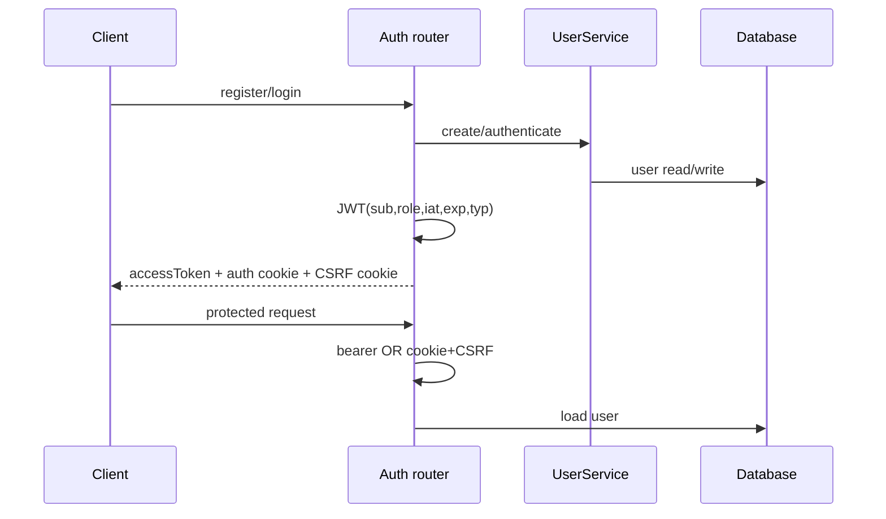
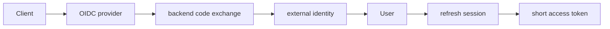

# Authentication and Session Architecture

## Cross-repository boundary

The backend supports both bearer JWTs and cookie sessions. That is sufficient for a future handoff from the sibling KusShoes portal to this editor when both use the same backend identity and compatible hosts. This is not complete today: the active KusShoes login screen uses timers and navigates locally, and its `src/api/client.ts` is not consumed. Consequently, documentation that describes a working marketing-to-editor SSO loop is a target setup, not verified current behavior.

## Current flow

The backend provides first-party email/password authentication with Argon2 hashes and HS256 JWT access tokens. It has no refresh tokens, revocation, password reset, email verification, MFA, OAuth/OIDC or tenant membership model.

JWT lifetime defaults to 1,440 minutes. `get_current_user` prefers bearer auth, otherwise reads the HttpOnly cookie and validates double-submit CSRF for POST/PUT/PATCH/DELETE. Login/register also expose the token in JSON.

## Client sessions

| Client | Token persistence | Validation/logout |
|---|---|---|
| Web | localStorage plus cookies | project flow calls `/auth/me`; logout calls backend and clears local token |
| Native mobile | secure storage | startup checks presence only; logout clears local token |
| Flutter web | localStorage | same presence-only behavior |
| Desktop | React behavior against local sidecar | independent local identity/session |

Stateless logout cannot revoke a copied token. Mobile does not call backend logout.

## Demo auth and authorization

With `ENABLE_DEMO_AUTH`, a static configured token maps to a demo user. It is intended for local/demo/desktop only. Production templates disable it, but startup does not fail when unsafe defaults are accidentally used.

Ownership checks live in `ProjectService`, `DesignService`, `ModelAssetService`, `DesignAssetService`, `JobService` and `ExportPackageService`; foreign resources generally return 404. Editor permissions are currently all true for the owner. There is no sharing/ACL implementation.

## Future SSO/OIDC

SSO is feasible because protected callers converge on `get_current_user` and internal user IDs. Recommended evolution:

1. Add `external_identities(provider, issuer, subject, user_id)` rather than replacing users.
2. Use authorization-code + PKCE for web/mobile/desktop.
3. Validate issuer, audience and rotating JWKS.
4. Issue short access tokens and rotating server-tracked refresh sessions.
5. Add organization/project memberships and derive `EditorPermissions` from ACLs.
6. Add desktop deep-link callback and native secure refresh-token handling.
7. Keep demo auth only as an explicit non-production adapter.

## Security work

- Reject production startup with default secret, debug/demo enabled or insecure cookies.
- Add refresh/revocation lifecycle and auth rate limits.
- Validate JWT `typ`, issuer and audience.
- Prefer secure same-site cookie sessions for browser deployments over localStorage bearer tokens.
- Make mobile validate `/auth/me` and recover cleanly from 401.

Sources: `backend/app/api/auth.py`, `api/deps.py`, `core/security.py`, `services/users.py`, frontend clients and mobile `backend_api.dart`.
