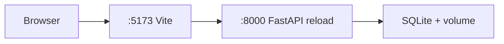
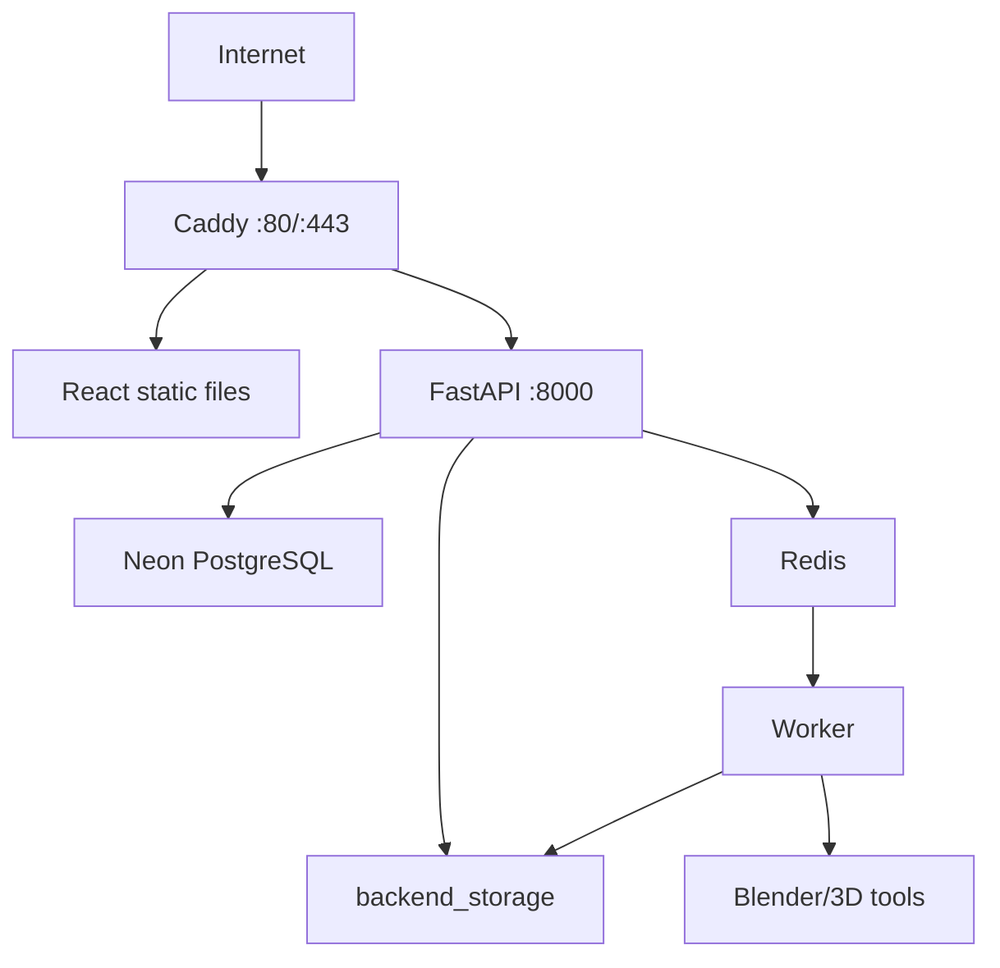

# Deployment Architecture

## Deployment boundary

Production Compose deploys the FastAPI API, RQ worker, Redis, Caddy, and `ar-ai-exe/frontend`. It does not clone or build the sibling KusShoes marketing repository. Deploying the public portal therefore requires a separate pipeline and an explicit contract for API URL, editor URL, cookie domain/SameSite/Secure policy, and CORS origins.

## Local development

### Native tools

```text
backend:  uv sync → alembic upgrade head → uvicorn app.main:app
frontend: npm install → npm run dev
mobile:   flutter run --dart-define=BACKEND_BASE_URL=...
desktop:  npm install → npm run dev (also needs Rust, WebView2, backend .venv)
```

Full scan reconstruction additionally requires FFmpeg, COLMAP, OpenMVS and Blender. Bake/import cleanup require Blender. Local defaults use SQLite and local storage.

### Development Compose

`docker-compose.dev.yml` starts a hot-reload FastAPI container and Vite container. It uses `backend/Dockerfile.dev`, SQLite and a named storage volume. Only FFmpeg is installed; real reconstruction and Blender-dependent behavior are unavailable unless the environment/image is extended. Redis/worker are not present.



## Production Compose

`docker-compose.yml` defines:

| Service | Image/build | Responsibility |
|---|---|---|
| `redis` | `redis:7-alpine` | RQ queue |
| `backend` | full `backend/Dockerfile` | migrations + FastAPI |
| `worker` | same backend image | `app.workers.rq_worker` |
| `web` | frontend build + Caddy | TLS/static SPA/reverse proxy |

API and worker mount `backend_storage`. Caddy exposes 80/443, caps request bodies at 260 MB, applies security headers, proxies `/api/*` and `/health`, and serves SPA fallback. Compose includes CPU/memory/swap limits and readiness dependencies.



The full backend image compiles OpenMVS in a build stage, installs Blender/COLMAP/FFmpeg, copies Alembic/application code, and runs migrations before Uvicorn. Building it is resource- and time-intensive.

## Environment and host setup

`deploy/.env.example` contains host/domain and resource sizing. `deploy/backend.env.example` is the production application template; actual `deploy/.env` and `deploy/backend.env` are ignored secrets. `deploy/ufw-allow-web.sh` configures web firewall access. `docs/vps-android-deployment.md` describes VPS and Android connectivity.

Production must provide at least:

- strong JWT/demo credentials and secure cookie settings;
- PostgreSQL/Neon URL with TLS;
- Redis URL;
- public web/CORS origins;
- storage configuration and persistent capacity;
- tool/resource thresholds.

## CI/CD

| Workflow | Trigger scope | Checks |
|---|---|---|
| `backend-ci.yml` | backend/workflow changes | whitespace, Python/uv install, Ruff, pytest |
| `frontend-ci.yml` | frontend/workflow changes | Node install, `npm ci`, typecheck/build |
| `mobile-ci.yml` | mobile/workflow changes | Java/Flutter setup, dependencies, analyze, tests |
| `sonarcloud.yml` | main push/PR/manual | Sonar quality gate; high-risk findings become GitHub issues |

`.husky/pre-push` detects changed areas and mirrors relevant CI checks where local toolchains exist. `scripts/sonarcloud_issue_export.py` uses SonarCloud and GitHub REST interfaces, deduplicates by an issue marker and creates labels/issues for blocker/critical/high reliability/security findings.

There is currently no workflow that builds/pushes container images, deploys Compose, runs Alembic as a controlled release stage, builds a mobile artifact, signs a desktop installer, or performs rollback/smoke tests. CI exists; continuous deployment does not.

## Recommended release pipeline

```mermaid
flowchart LR
    PR --> Checks["lint/test/build/security"]
    Checks --> Image["versioned immutable images"]
    Image --> Stage["staging migrations + deploy"]
    Stage --> Smoke["API/editor/upload/bake smoke"]
    Smoke --> Approval["production approval"]
    Approval --> Migrate["backward-compatible migration"]
    Migrate --> Prod["rolling deploy"]
    Prod --> Observe["logs, metrics, queue/storage alerts"]
```



Required production additions include image registry/SBOM/scanning, migration rollback strategy, backup/restore testing, secret manager, health/metrics/log aggregation, queue-depth and disk alerts, artifact retention, deployment approvals and versioned desktop/mobile release signing.
