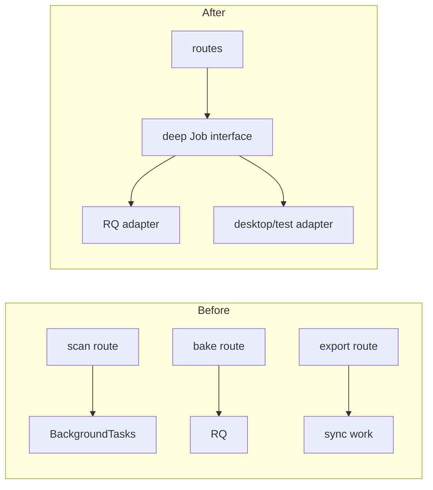

# Refactor Recommendations

These recommendations preserve current business behavior. Terms follow the repository architecture-review vocabulary: a **module** hides an implementation behind an **interface**; a **seam** is where behavior can vary; an **adapter** implements that interface; **depth** should provide leverage and locality.

## Priority summary

| Priority | Recommendation | Strength | Primary benefit |
|---:|---|---|---|
| 1 | Durable processing job module | Strong | reliability and one lifecycle for heavy work |
| 2 | Frontend editor-session module | Strong | locality for save/bake/preview/export state |
| 3 | Artifact staging/version module | Strong | real local/S3/cloud portability |
| 4 | Consolidated HTTP transport adapter | Strong | remove duplicated auth/CSRF/errors |
| 5 | Split Blender script generation from orchestration | Strong | testability and maintainable 3D logic |
| 6 | Explicit project/model/design repository queries | Strong | correctness and testable ownership |
| 7 | Streaming/resumable upload module | Worth exploring | memory and mobile reliability |
| 8 | Desktop cloud/local runtime modes | Worth exploring | removes hidden split-brain behavior |

## 1. Durable processing job module

**Files:** `api/scan_sessions.py`, `services/reconstruction.py`, `services/jobs.py`, `services/export_packages.py`, `workers/*`, `models/entities.py`.

**Problem:** three heavy workflows expose three execution models: reconstruction uses process-local `BackgroundTasks`, bake uses RQ, export runs synchronously. Status/error/retry rules are scattered. API restart can lose reconstruction; export ties up a request.

**Recommendation:** deepen the Job module around typed work (`reconstruct`, `cleanup/import`, `bake`, `export`), idempotency key, attempt, progress and artifact result. Keep tool-specific implementations internal. RQ is the existing adapter; an inline adapter remains for desktop/test.

This concentrates lifecycle bugs and tests at one interface and enables retries/cancellation/observability without changing domain outputs.

## 2. Frontend editor-session module

**Files:** `frontend/src/App.tsx`, `ModelViewer.tsx`, `EditorPanels.tsx`, `useEditorContext.ts`.

**Problem:** `App.tsx` owns routing, auth, desktop runtime, scan/import load, design state, asset hydration, save/bake polling and export. Numerous booleans encode an implicit state machine. Viewer and panel files also mix geometry/presentation/domain transforms.

**Recommendation:** introduce an editor-session module/hook with explicit states (`loading`, `ready-clean`, `ready-dirty`, `saving`, `baking`, `preview-ready`, `exporting`, `failed`). Keep view modules driven by a small command/state interface. Separate launcher/auth/legacy import route shells from project editor composition.

Benefits are locality for transition rules and a test surface that can execute complete save/bake/export behavior without rendering the 3D scene.

## 3. Artifact staging and immutable version module

**Files:** `services/storage.py`, `reconstruction.py`, `mesh_cleanup.py`, `decal_baker.py`, `designs.py`, `export_packages.py`, ORM/migrations.

**Problem:** the storage seam is shallow because callers still ask for `local_path`; processing therefore knows the adapter. Artifact identity is a mutable path on an aggregate.

**Recommendation:** add a staging interface: materialize an input version into a scoped workspace, publish declared outputs, verify checksums, clean workspace. Add immutable asset-version metadata and lineage. Local and S3 become real adapters because both satisfy the same processing interface.

## 4. Consolidate HTTP transport

**Files:** `frontend/src/api/client.ts`, `editorClient.ts`, `runtimeConfig.ts`.

**Duplication:** request parsing, bearer header, CSRF header, credentials and error classes are implemented twice.

**Recommendation:** one transport adapter should own base URL, auth/CSRF, response/error parsing and binary behavior. Feature-facing modules (`authClient`, `projectClient`, `assetClient`) should delegate to it. Generate or contract-test types from OpenAPI to prevent Pydantic/TypeScript drift.

Deletion test: deleting either current client reintroduces almost identical complexity; the duplication is real, while one deep transport interface provides leverage across all callers.

## 5. Separate Blender program generation

**Files:** `services/decal_baker.py` (~1,104 lines), `mesh_cleanup.py` (~448), `reconstruction.py`.

**Problem:** validation, file preparation, embedded script source, subprocess execution and output verification coexist. Tests often search generated script text rather than execute a stable program interface.

**Recommendation:** create internal modules for normalized bake specification, deterministic script rendering, execution, and result validation. Keep scripts server-authored and preserve all material/hit-ratio invariants. Version the bake/cleanup specification so preview/export reproduction is possible.

Do not over-abstract one-off Blender helpers into public seams; use internal seams only where tests and two workflows genuinely vary.

## 6. Query and aggregate correctness

**Files:** `services/projects.py`, `model_assets.py`, `designs.py`, `entities.py`.

**Problems:** ownership joins are repeated; latest model is indirectly found through scan; `latest_design` combines project/model predicates with `OR`; imported models require synthetic scans; response assembly repeats model URL knowledge.

**Recommendation:** define explicit owner-scoped aggregate queries with names that encode semantics, e.g. latest model for project and latest design for exact project/model pair. Add regression tests before changing the predicate. Longer-term, give ModelAsset a direct project relationship while retaining scan provenance.

## 7. Upload depth and mobile reliability

**Files:** mobile `backend_api.dart`, `upload_progress_screen.dart`, backend scan/model routes.

**Problems:** full-file memory buffering, sequential all-or-nothing UI, whole-flow retry creates orphan sessions, no resume/idempotency.

**Recommendation:** add upload sessions, per-part completion, idempotency and streaming/direct multipart. Mobile should persist upload IDs and resume each pass. This preserves the product flow while improving performance and UX on unstable networks.

## 8. Explicit desktop local/cloud modes

**Files:** `desktop/src-tauri/src/main.rs`, `backend/app/desktop_entrypoint.py`, frontend mode detection.

**Problem:** the desktop UI resembles the web editor but reads an independent local database. A user can reasonably assume shared cloud state. Port 8000 reuse can also attach to an unrelated compatible backend.

**Recommendation:** make runtime mode explicit:

- Local workspace: local sidecar/SQLite/assets.
- Cloud workspace: cloud authentication/project manifest with local cache/processing adapter.

Display provenance and sync state. Validate a backend instance identity rather than only `/health` text before reusing port 8000.

## Additional debt

| Finding | Recommendation |
|---|---|
| production-unsafe defaults | environment validator that fails closed |
| state values are free strings | shared transition functions and DB checks where portable |
| design assets lack aggregate link | add project/design usage references and cleanup policy |
| no client tests | contract, editor-session, viewer geometry and mobile flow tests |
| static prototype mobile features | feature flags or clearly separated prototype module |
| stale/encoding-broken docs | archive/supersede with this set and enforce UTF-8 link checks |
| no observability | structured correlation IDs, job metrics, queue/disk/tool health |
| CORS regex hard-coded LAN host | derive explicit allowed origins from settings |

## Recommended sequence

1. Add characterization tests for current project/save/bake/export and upload behavior.
2. Consolidate frontend transport and extract editor-session state without UI changes.
3. Unify heavy work behind the Job interface.
4. Add artifact staging, then immutable versions.
5. Introduce cloud upload/manifest and explicit desktop cloud mode.

Each step should be a vertical change with backward-compatible HTTP responses and canonical file names.