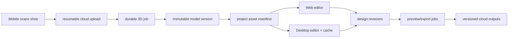
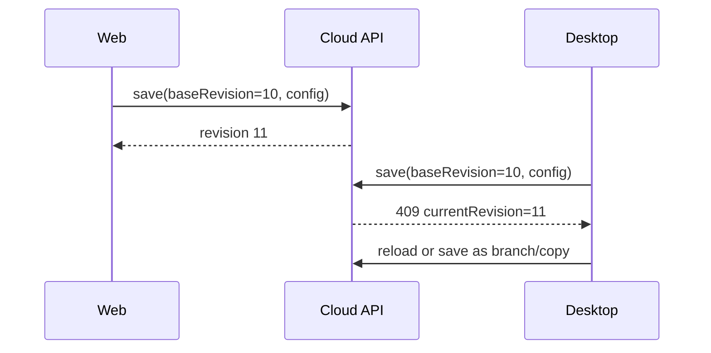
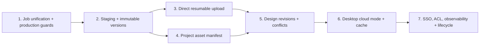

# Future Direction: Cloud-Synchronized Shoe Assets

## Feasibility verdict

The vision is **feasible**, and several foundations already exist: project IDs, owner-scoped interfaces, canonical ModelAsset files, storage adapters, checksums, web editor context, a shared web/desktop editor, background bake jobs, and PostgreSQL deployment.

The current architecture cannot yet deliver the complete vision because desktop is local-only, artifacts are not versioned, the S3 adapter cannot feed local processing tools, large uploads are not resilient, and designs have no revision/conflict protocol.

The companion KusShoes portal adds another required migration: replace its in-memory `Project` model and simulated login/desktop status with the backend's `Project`, authentication, editor-context, job, and export contracts. The port-8421 daemon narrative should either be removed or specified as a real, authenticated local bridge; it is not the mechanism used by the current Tauri desktop shell.

## Target journey

## Capability-by-capability assessment

| Future step | Current support | Gap |
|---|---|---|
| Mobile scans real shoes | guided two-pass capture exists | quality gates, resume, background upload, status polling |
| Generate 3D model | toolchain orchestration exists | durable queue, scalable worker, reproducibility/observability |
| Upload model to cloud | S3 adapter and metadata exist | staging, immutable versions, direct upload/publish protocol |
| Web loads model | editor context/canonical URL exists | signed version manifest, CDN/cache strategy |
| Desktop loads same model | same editor code exists | cloud auth/mode, cache, sync/provenance |
| Platforms synchronize | project/design records exist | revisions, optimistic concurrency, events, conflict UX |

## Exact architectural changes

### 1. Make cloud Project the authoritative aggregate

Every scan, model version, design revision, job and export must belong to a project. Add direct `project_id` to model assets/versions and project/design references for design assets. Retain scan session as provenance, not the only model parent.

### 2. Add immutable asset versions and manifests

Introduce model/preview/export versions with checksum, size, media type, processing recipe/tool versions and parent lineage. `GET /projects/{id}/editor-context` should return or reference a versioned manifest. Existing canonical filenames can remain inside each version for backward compatibility.

### 3. Move all heavy work to durable jobs

Reconstruction, cleanup/import, bake and export should use one durable lifecycle with idempotency, retries, leases/heartbeats and terminal artifacts. API processes must not own long work. Workers stage files to ephemeral SSD and publish atomically.

### 4. Complete object-storage support

Add direct multipart upload sessions for mobile/import, server-side completion validation, event/job enqueue, worker input staging and signed/CDN downloads. API should authorize metadata/control operations without proxying every large byte stream.

### 5. Add design revision and synchronization semantics

Store immutable `DesignRevision` documents with parent revision, author/client, timestamp and model version. Mutations send `baseRevision`; conflicts return 409. Initially use optimistic concurrency and explicit reload/duplicate conflict UX rather than real-time collaborative editing.

### 6. Build explicit desktop cloud mode

Desktop authenticates through OIDC/PKCE, requests the project manifest, verifies/downloads assets into a checksum cache, and edits the same cloud revisions. Local Blender can be an optional processing adapter; its outputs are uploaded and registered through jobs. Offline editing should be deferred until online revision synchronization is stable.

### 7. Strengthen identity and sharing

Add refresh sessions, external identities/SSO, project memberships/roles and permission-derived editor context. Desktop/mobile require native secure token storage and deep-link login callbacks.

### 8. Add operational architecture

Required: queue/object/database observability, per-project quotas, retention/deletion, backup/restore, processing-cost controls, worker autoscaling, tool image versioning, security scanning and audit events.

## Suggested rollout

## Compatibility strategy

- Keep `/editor/{projectId}` as the entry point.
- Keep current canonical filenames within version folders.
- Extend `EditorContext` additively before deprecating legacy URLs.
- Continue supporting local storage and inline desktop adapter for offline demo/development.
- Backfill current ModelAsset and Design rows as version 1/revision 1.
- Do not change material preservation, hit-ratio, layer/file-size or server-authored-script invariants.

## Final assessment

No rewrite is required. The correct evolution is to deepen three existing seams—jobs, artifact storage/staging, and editor project context—then add immutable revisions and an explicit desktop cloud adapter. The highest-risk mistake would be connecting desktop directly to shared mutable files without asset versions and concurrency semantics.
