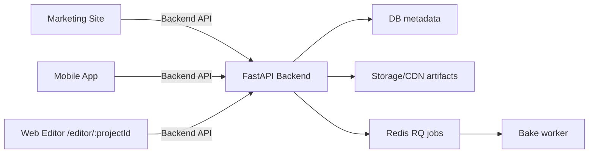
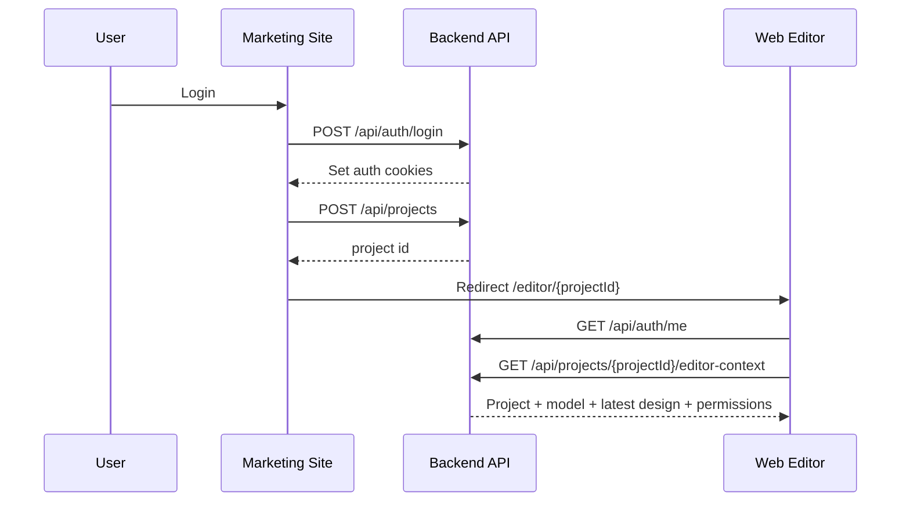
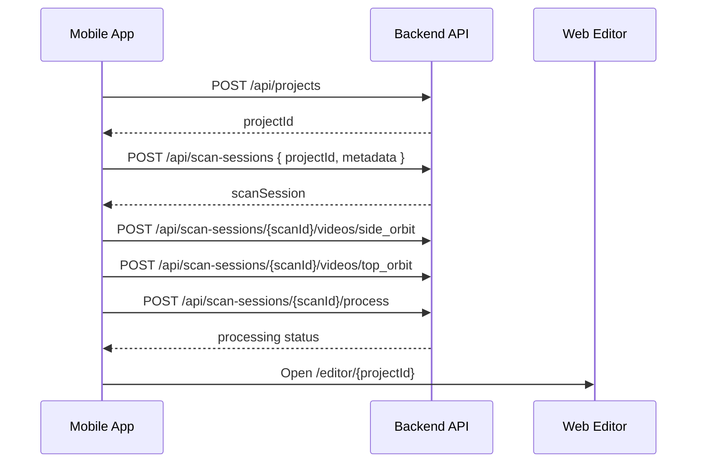

# KusShoes Editor Integration Guide

Tài liệu này dành cho team **Marketing Site** và **Mobile App** để kết nối với web editor hiện tại mà không phụ thuộc local state của editor.

Nguyên tắc chính: **Marketing Site, Mobile App và Web Editor chỉ trao đổi qua Backend API**. Không truyền `designConfig`, model URL, user data, subscription data hoặc access token qua URL editor.

## 1. System Boundary



| Client | Sở hữu | Không được làm |
|---|---|---|
| Marketing Site | Login, dashboard, project creation, subscription/billing, project list, export history | Không tự dựng editor state, không gọi thẳng editor internals |
| Mobile App | Login, user profile, scan/upload, create/view project, open editor link | Không upload file trực tiếp vào editor, không truyền token qua URL |
| Web Editor | Load project context, customize shoe, save draft, bake preview, export ZIP | Không tạo billing/subscription/dashboard, không là source of truth |
| Backend API | Auth, project, model asset, design, job, export, permissions | Không trả raw filesystem path hoặc chạy script user-provided |

## 2. Domains Và Route

Production target:

```txt
Marketing Site: https://kusshoes.vn
Editor App:     https://app.kusshoes.vn
Backend API:    https://api.kusshoes.vn
CDN/Storage:    https://cdn.kusshoes.vn
```

Editor route chính:

```txt
https://app.kusshoes.vn/editor/{projectId}
```

Ví dụ:

```txt
https://app.kusshoes.vn/editor/proj_123
```

Editor chỉ cần `projectId`. Mọi dữ liệu còn lại được fetch từ backend qua:

```http
GET /api/projects/{projectId}/editor-context
```

## 3. Authentication Contract

### 3.1 Web/Marketing Auth

Web/editor ưu tiên HTTP-only cookie:

```txt
kusshoes_access_token  HTTP-only
kusshoes_csrf_token    readable by browser JS
```

Backend login/register/demo-login sẽ set cookie nếu gọi qua browser với `credentials: include`.

Frontend request từ Marketing Site hoặc Editor phải:

```ts
fetch("https://api.kusshoes.vn/api/auth/me", {
  credentials: "include",
});
```

Các request mutating bằng cookie auth (`POST`, `PUT`, `PATCH`, `DELETE`) phải gửi CSRF header:

```ts
fetch("https://api.kusshoes.vn/api/projects", {
  method: "POST",
  credentials: "include",
  headers: {
    "Content-Type": "application/json",
    "X-CSRF-Token": readCookie("kusshoes_csrf_token"),
  },
  body: JSON.stringify({ name: "Air Force 1 Custom", sourceType: "uploaded_glb" }),
});
```

Không truyền long-lived access token trong editor URL.

Sai:

```txt
/editor/proj_123?token=...
/editor/proj_123?designConfig=...
```

Đúng:

```txt
/editor/proj_123
```

### 3.2 Mobile Auth

Mobile hiện có thể tiếp tục dùng bearer token cho Backend API:

```http
Authorization: Bearer <accessToken>
```

Khi mở editor bằng external browser, browser phải có web session cookie. Nếu chưa có cookie, editor sẽ redirect về:

```txt
https://kusshoes.vn/login?redirect=https%3A%2F%2Fapp.kusshoes.vn%2Feditor%2Fproj_123
```

Khuyến nghị MVP:

- Mobile dùng Backend API bằng bearer token để tạo project, upload scan/model.
- Mobile mở external browser tới `/editor/{projectId}`.
- Nếu browser chưa login, người dùng login lại trên Marketing Site rồi quay về editor qua `redirect`.

Không khuyến nghị MVP:

- Nhét token vào URL.
- Inject token vào WebView localStorage.
- Mobile gọi thẳng API riêng của editor.

## 4. Marketing Site Integration Flow



### Create Project

```http
POST /api/projects
```

Request:

```json
{
  "name": "Air Force 1 Custom",
  "sourceType": "uploaded_glb",
  "templateId": null
}
```

`sourceType` values:

```txt
scan
uploaded_glb
uploaded_obj
template
```

Response:

```json
{
  "id": "proj_123",
  "name": "Air Force 1 Custom",
  "status": "draft",
  "sourceType": "uploaded_glb",
  "thumbnailUrl": null,
  "createdAt": "2026-06-12T10:00:00Z",
  "updatedAt": "2026-06-12T10:00:00Z"
}
```

Sau đó Marketing Site redirect:

```ts
window.location.href = `https://app.kusshoes.vn/editor/${project.id}`;
```

### Project List

```http
GET /api/projects
```

Response:

```json
{
  "items": [
    {
      "id": "proj_123",
      "name": "Air Force 1 Custom",
      "status": "ready",
      "thumbnailUrl": null,
      "updatedAt": "2026-06-12T10:00:00Z"
    }
  ]
}
```

### Export History

```http
GET /api/projects/{projectId}/exports
```

Response:

```json
{
  "items": [
    {
      "id": "export_123",
      "designId": "design_123",
      "status": "ready",
      "downloadUrl": "/api/exports/export_123/download",
      "zipUrl": "/api/exports/export_123/download",
      "files": ["final_shoe.glb", "final_shoe.obj", "final_shoe.mtl"],
      "createdAt": "2026-06-12T10:00:00Z"
    }
  ]
}
```

## 5. Mobile App Integration Flow

Mobile có hai flow chính.

### 5.1 Create Project Then Upload Scan



Create scan attached to project:

```http
POST /api/scan-sessions
```

Request:

```json
{
  "projectId": "proj_123",
  "metadata": {
    "shoe": {
      "sizeSystem": "EU",
      "size": "42",
      "side": "both",
      "type": "sneaker",
      "material": "leather",
      "condition": "new"
    },
    "measurements": {
      "lengthCm": 27.5,
      "widthCm": 9.5
    },
    "scanSetup": {
      "calibrationReference": "A4 paper",
      "lighting": "bright",
      "background": "plain"
    },
    "customizationGoal": ["visual_customization"]
  }
}
```

Response includes:

```json
{
  "id": "scan_123",
  "projectId": "proj_123",
  "status": "created",
  "webDesignUrl": "https://app.kusshoes.vn/editor/proj_123"
}
```

Upload required videos:

```http
POST /api/scan-sessions/{scanId}/videos/side_orbit
POST /api/scan-sessions/{scanId}/videos/top_orbit
```

Use `multipart/form-data` field:

```txt
video=<mp4 file>
metadata=<optional JSON string>
```

Start processing:

```http
POST /api/scan-sessions/{scanId}/process
```

### 5.2 Create Project Then Upload Model

Use this when Mobile already has GLB/OBJ asset.

```http
POST /api/models/import
```

Use `multipart/form-data`:

```txt
projectId=proj_123
name=Air Force 1 Custom
format=glb
metadata=<scan metadata JSON string>
model=<shoe_preview.glb>
```

For OBJ:

```txt
projectId=proj_123
name=Air Force 1 Custom
format=obj
metadata=<scan metadata JSON string>
model=<shoe.obj>
mtl=<shoe.mtl optional>
texture=<shoe_texture.png optional>
```

Response:

```json
{
  "scanSession": {
    "id": "scan_123",
    "projectId": "proj_123",
    "status": "completed",
    "webDesignUrl": "https://app.kusshoes.vn/editor/proj_123"
  },
  "modelAsset": {
    "id": "model_123",
    "projectId": "proj_123",
    "status": "ready",
    "sourceType": "uploaded_glb",
    "canonicalGlbUrl": "/api/models/model_123/download/glb"
  }
}
```

## 6. Editor Context Contract

Editor calls:

```http
GET /api/projects/{projectId}/editor-context
```

Response:

```json
{
  "project": {
    "id": "proj_123",
    "name": "Air Force 1 Custom",
    "status": "ready",
    "sourceType": "uploaded_glb",
    "thumbnailUrl": null,
    "createdAt": "2026-06-12T10:00:00Z",
    "updatedAt": "2026-06-12T10:00:00Z"
  },
  "modelAsset": {
    "id": "model_123",
    "projectId": "proj_123",
    "status": "ready",
    "sourceType": "uploaded_glb",
    "canonicalGlbUrl": "/api/models/model_123/download/glb",
    "objUrl": "/api/models/model_123/download/obj",
    "mtlUrl": "/api/models/model_123/download/mtl",
    "textureUrls": ["/api/models/model_123/download/texture"]
  },
  "latestDesign": {
    "id": "design_123",
    "projectId": "proj_123",
    "modelAssetId": "model_123",
    "name": "Air Force 1 Custom",
    "status": "draft",
    "previewStatus": "ready",
    "previewGlbUrl": "/api/designs/design_123/preview/glb",
    "previewErrorMessage": null,
    "designConfig": {
      "modelAssetId": "model_123",
      "baseColor": "#ffffff",
      "material": { "roughness": 1, "metallic": 0 },
      "stickers": [],
      "texts": [],
      "metadata": { "editorVersion": "1.0.0" }
    },
    "createdAt": "2026-06-12T10:00:00Z",
    "updatedAt": "2026-06-12T10:00:00Z"
  },
  "permissions": {
    "canEdit": true,
    "canBake": true,
    "canExport": true
  }
}
```

Editor load rule:

1. Nếu `latestDesign.previewStatus === "ready"` và có `previewGlbUrl`, load preview GLB.
2. Nếu không, load `modelAsset.canonicalGlbUrl` khi `modelAsset.status === "ready"`.
3. Nếu model chưa ready, show processing state.
4. Nếu project/model failed, show error state.

## 7. Save, Bake, Export Contract

Marketing/Mobile thường không cần gọi các endpoint này. Đây là contract để hiểu trạng thái project/design/export trên dashboard.

### Save Draft

```http
POST /api/projects/{projectId}/designs
```

Request:

```json
{
  "name": "Air Force 1 Custom",
  "designConfig": {
    "modelAssetId": "model_123",
    "baseColor": "#ffffff",
    "material": { "roughness": 1, "metallic": 0 },
    "stickers": [],
    "texts": [],
    "metadata": { "editorVersion": "1.0.0" }
  }
}
```

Response:

```json
{
  "id": "design_123",
  "projectId": "proj_123",
  "modelAssetId": "model_123",
  "status": "draft",
  "previewStatus": "pending",
  "designConfig": {},
  "previewGlbUrl": null,
  "updatedAt": "2026-06-12T10:00:00Z"
}
```

### Bake Preview

```http
POST /api/designs/{designId}/bake
```

Response:

```json
{
  "id": "job_123",
  "type": "bake",
  "status": "queued",
  "progress": 0,
  "errorMessage": null,
  "designId": "design_123",
  "projectId": "proj_123",
  "createdAt": "2026-06-12T10:00:00Z",
  "updatedAt": "2026-06-12T10:00:00Z"
}
```

Poll:

```http
GET /api/jobs/{jobId}
```

Job status values:

```txt
queued
processing
completed
failed
```

Sau khi `completed`, editor gọi:

```http
GET /api/designs/{designId}
```

Rồi reload preview:

```txt
previewGlbUrl?t=<timestamp>
```

### Export Package

```http
POST /api/designs/{designId}/export
```

Response:

```json
{
  "id": "export_123",
  "designId": "design_123",
  "status": "ready",
  "downloadUrl": "/api/exports/export_123/download",
  "zipUrl": "/api/exports/export_123/download",
  "files": [
    "final_shoe.glb",
    "final_shoe.obj",
    "final_shoe.mtl",
    "final_texture.png",
    "design_config.json",
    "production_notes.json"
  ],
  "createdAt": "2026-06-12T10:00:00Z"
}
```

Download:

```http
GET /api/exports/{exportId}/download
```

## 8. Error Format

All API errors should be treated as:

```json
{
  "error": {
    "code": "PROJECT_NOT_FOUND",
    "message": "Project not found.",
    "details": {}
  }
}
```

Common codes:

```txt
UNAUTHORIZED
FORBIDDEN
PROJECT_NOT_FOUND
MODEL_NOT_READY
DESIGN_NOT_FOUND
JOB_NOT_FOUND
BAKE_FAILED
EXPORT_FAILED
QUOTA_EXCEEDED
INVALID_DESIGN_CONFIG
INVALID_REQUEST
SERVICE_UNAVAILABLE
```

Client behavior:

| Code | Marketing Site | Mobile App |
|---|---|---|
| `UNAUTHORIZED` | Redirect login with `redirect` param | Re-authenticate or refresh token |
| `FORBIDDEN` | Show no-access state | Show no-access state |
| `PROJECT_NOT_FOUND` | Remove stale link or show 404 | Show project missing |
| `MODEL_NOT_READY` | Show processing state | Poll scan/model status |
| `BAKE_FAILED` | Show latest design error in dashboard | Show editor retry guidance if embedded |
| `SERVICE_UNAVAILABLE` | Retry later | Retry later |

## 9. Status Values

Project:

```txt
draft
processing
ready
failed
archived
```

ModelAsset:

```txt
uploaded
processing
ready
failed
```

Design preview:

```txt
pending
processing
ready
failed
```

Export:

```txt
processing
ready
failed
```

## 10. Marketing Site Checklist

- Login/register calls Backend API with `credentials: include`.
- CORS allowlist includes `https://kusshoes.vn`.
- Auth cookies are scoped for `.kusshoes.vn` in production.
- Dashboard creates project using `POST /api/projects`.
- Dashboard opens editor using only `/editor/{projectId}`.
- Dashboard does not send access token, model URL, design config, or billing state to editor.
- Dashboard reads export history from `/api/projects/{projectId}/exports`.
- Logout calls `/api/auth/logout` and clears local UI state.

## 11. Mobile App Checklist

- Mobile stores bearer token securely and uses it only for Backend API.
- Mobile creates project before scan/import when user starts a customization flow.
- Mobile sends `projectId` in `POST /api/scan-sessions` or `POST /api/models/import`.
- Mobile opens `webDesignUrl` or `/editor/{projectId}`.
- Mobile does not put token in editor URL.
- Mobile treats browser login redirect as expected if no web cookie exists.
- Mobile polls scan/process status before telling user model is ready.

## 12. Environment Requirements

Backend production env must include:

```txt
CORS_ORIGINS=["https://kusshoes.vn","https://app.kusshoes.vn"]
WEB_APP_BASE_URL=https://app.kusshoes.vn
MARKETING_LOGIN_URL=https://kusshoes.vn/login
AUTH_COOKIE_DOMAIN=.kusshoes.vn
AUTH_COOKIE_SECURE=true
AUTH_COOKIE_SAMESITE=lax
REDIS_URL=redis://redis:6379/0
RQ_QUEUE_NAME=kusshoes-jobs
```

Frontend build env must include:

```txt
VITE_API_BASE_URL=https://api.kusshoes.vn
VITE_MARKETING_LOGIN_URL=https://kusshoes.vn/login
```

Docker Compose currently provides:

- `backend`
- `web`
- `redis`
- `worker`

`worker` must share the backend storage volume because bake jobs read/write model and preview artifacts.

## 13. Integration Acceptance Test

Use this as the cross-team go-live test:

1. Marketing user logs in.
2. Marketing creates project through Backend API.
3. Marketing redirects to `https://app.kusshoes.vn/editor/{projectId}`.
4. Editor calls `/api/auth/me`.
5. Editor calls `/api/projects/{projectId}/editor-context`.
6. Mobile or Marketing-attached upload makes `modelAsset.status = ready`.
7. Editor loads the model.
8. User customizes shoe.
9. Editor saves draft.
10. Editor triggers bake job.
11. Editor polls job until completed.
12. Editor reloads baked preview.
13. Editor exports ZIP.
14. Marketing dashboard shows the export in `/api/projects/{projectId}/exports`.

If all 14 steps pass without passing token/design/model data through editor URL, the integration is correct.
