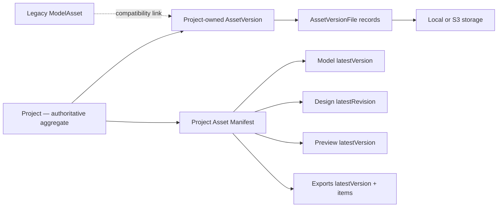

# Sprint 1: Cloud Asset Manifest Foundation

## Status

- Branch: `connect/sprint-1-cloud-asset-manifest`
- State: approved with architectural amendments; implementation not started
- Scope: backend foundation only
- Commit policy: do not create commits without explicit user instruction

## Goal

Prepare `ar-ai-exe` for cloud-synchronized shoe assets without rewriting the application or changing the user-facing editor flow.

Sprint 1 covers:

1. Cloud-storage compatibility.
2. Immutable asset versions.
3. Project Asset Manifest API.

It does not cover AI, marketplace, AR, billing, real-time collaboration, frontend redesign, desktop cloud mode, resumable upload, or a unified durable job system.

## Architecture direction

- Backend remains the system of record.
- `Project` is the authoritative aggregate.
- `AssetVersion` belongs directly to `Project`; it is not owned by `ModelAsset`.
- `ModelAsset` remains a legacy compatibility projection.
- The manifest reserves a stable shape for model, design revision, preview, and exports.
- Mobile, Web Editor, and Desktop should eventually resolve the same model through a project manifest.
- `/editor/{projectId}` remains the primary editor entry point.
- Existing `ModelAsset`, `Design`, editor-context, and model-download interfaces remain backward compatible.
- Existing material, decal, cleanup, canonical-file, and server-authored Blender-script invariants remain unchanged.



### Design Revision concept

`DesignRevision` is the future immutable representation of saved design state. It can later contain a revision ID, parent revision, model-version reference, author/client metadata, configuration checksum, and creation time.

Sprint 1 does not add a `design_revisions` table or change design-save behavior. The manifest reserves `design.latestRevision` now so a later sprint can populate it without changing the response shape.

## Database migration plan

Create `backend/alembic/versions/20260702_0008_cloud_asset_versions.py`.

### `asset_versions`

| Column | Purpose |
|---|---|
| `id` | `assetv_<uuid>` primary key |
| `project_id` | authoritative project owner |
| `asset_type` | `model`, `preview`, `texture`, `export`, or future type |
| `logical_key` | stable slot within the project, initially `primary` |
| `version_number` | monotonic per project/type/logical key |
| `status` | publication/readiness state |
| `source_type` | scan/import/generated source |
| `parent_asset_version_id` | optional immutable lineage |
| `created_at` | immutable creation timestamp |

Constraints:

- Unique `(project_id, asset_type, logical_key, version_number)`.
- Index `(project_id, asset_type, created_at)`.
- Published version contents cannot be updated.

### `asset_version_legacy_links`

This compatibility table keeps legacy identities outside the core asset model.

| Column | Purpose |
|---|---|
| `asset_version_id` | immutable project asset |
| `legacy_type` | initially `model_asset` |
| `legacy_id` | existing `ModelAsset.id` |
| `created_at` | mapping timestamp |

Constraint: unique `(legacy_type, legacy_id, asset_version_id)`. The link is an adapter only; Project remains the owner of `AssetVersion`.

### `asset_version_files`

| Column | Purpose |
|---|---|
| `id` | primary key |
| `asset_version_id` | parent version |
| `file_type` | `glb`, `obj`, `mtl`, `texture`, metadata/report/package |
| `canonical_name` | backward-compatible filename |
| `storage_key` | stable local/S3 key |
| `content_type` | media type |
| `size_bytes` | file size |
| `checksum` | SHA-256 |
| `created_at` | publication timestamp |

Constraint: unique `(asset_version_id, file_type)`.

### Backfill

1. Resolve each legacy model's project through its scan session without adding project ownership to `ModelAsset`.
2. Create a project-owned `model/primary` version for every resolvable existing model.
3. Number versions chronologically per project/type/logical key.
4. Create file records from existing path, checksum, content-type, and size columns.
5. Create a compatibility link to the existing `ModelAsset`.
6. Do not copy, rename, or recompute existing blobs.
7. Leave unresolved legacy models on old APIs rather than failing migration.

## Backend changes

### ORM

Add `AssetVersion`, `AssetVersionFile`, `AssetVersionLegacyLink`, and Project-owned relationships. Do not add ownership from `AssetVersion` to `ModelAsset` or an active-version pointer to `Project`.

### `AssetVersionService`

Responsibilities:

- Create the next immutable project asset version for any supported `asset_type`.
- Register file metadata once.
- Enforce one file type per version.
- Resolve the latest published version by project/type/logical key.
- Resolve versions under project/user ownership.
- Reject mutation of published file records.
- Register optional legacy links without exposing them as the core ownership interface.

### `ProjectAssetManifestService`

Responsibilities:

- Load an owner-scoped project.
- Resolve latest project-owned versions by type and logical key.
- Return deterministic file ordering and metadata.
- Use signed S3 URLs when available.
- Fall back to authenticated immutable download URLs.
- Always return stable `project`, `model`, `design`, `preview`, and `exports` sections.
- Leave unavailable Sprint 1 values null.

### `ModelAssetService`

`create_from_files()` will publish, in one database transaction:

1. Legacy `ModelAsset` compatibility projection.
2. Project-owned immutable `AssetVersion` of type `model`.
3. `AssetVersionFile` records.
4. Optional `AssetVersionLegacyLink`.

New objects use version-scoped keys:

```text
projects/{projectId}/assets/{assetType}/{logicalKey}/versions/{assetVersionId}/
```

Existing stored keys and legacy downloads remain unchanged.

### `ProjectService`

- Keep current editor-context model fields.
- Add an optional `assetManifestUrl` to editor context.
- Do not make the React editor consume the manifest in Sprint 1.

## API plan

### Project Asset Manifest

`GET /api/projects/{projectId}/asset-manifest`

- Authenticated and owner-scoped.
- Returns a stable project/model/design/preview/exports document.
- Sprint 1 populates the project and latest model; design revision, preview, and exports may be null/empty.

Example:

```json
{
  "manifestVersion": 1,
  "project": {
    "id": "proj_123",
    "status": "ready",
    "updatedAt": "2026-07-02T00:00:00Z"
  },
  "model": {
    "latestVersion": {
      "assetVersionId": "assetv_123",
      "assetType": "model",
      "logicalKey": "primary",
      "versionNumber": 1,
      "status": "ready",
      "sourceType": "scan",
      "legacyModelAssetId": "model_123",
      "createdAt": "2026-07-02T00:00:00Z",
      "files": [
        {
          "fileType": "glb",
          "canonicalName": "shoe_preview.glb",
          "url": "/api/projects/proj_123/asset-versions/assetv_123/files/glb",
          "contentType": "model/gltf-binary",
          "sizeBytes": 123456,
          "checksum": "sha256"
        }
      ]
    }
  },
  "design": {
    "latestRevision": null
  },
  "preview": {
    "latestVersion": null
  },
  "exports": {
    "latestVersion": null,
    "items": []
  }
}
```

All five sections are always present. Later sprints populate reserved fields rather than introducing new top-level shapes.

### Immutable file download

`GET /api/projects/{projectId}/asset-versions/{versionId}/files/{fileType}`

- Authenticated and owner-scoped.
- Supports local-storage fallback.
- Resolves the selected version rather than mutable legacy fields.

### Additive editor-context field

```json
{
  "assetManifestUrl": "/api/projects/{projectId}/asset-manifest"
}
```

No existing field or endpoint is removed or renamed.

## Storage compatibility strategy

### Local storage

- Continue using `LocalStorageService`.
- New versions receive version-scoped keys.
- Immutable file downloads pass through authenticated FastAPI routes.
- Existing keys remain readable.

### S3-compatible storage

- Continue using `S3StorageService`.
- Generate signed URLs only after project authorization.
- Do not persist signed URLs; persist stable keys only.
- Keep signed URL lifetime bounded.

### Processing boundary

Sprint 1 does not rewrite reconstruction or Blender staging. Processors can continue producing local temporary files, after which `ModelAssetService` publishes outputs through the selected adapter.

Full S3 input staging remains a later sprint because current reconstruction and bake implementations require local paths.

### Immutability rules

- Never update a published version’s file records.
- Never reuse a version-scoped storage key.
- Reprocessing produces a new version.
- Publish the new version and all files atomically; latest resolution uses the highest published version number for its project/type/logical key.
- Keep legacy `ModelAsset` columns as compatibility projections.

## Tests

### Asset versions

- Model creation publishes version 1 and expected file records.
- Later publication creates another version without mutating version 1.
- Project/type/logical-key latest resolution returns the new version.
- Preview, texture, and export asset types can be created without a `ModelAsset`.
- Legacy links are optional and do not control version ownership.
- Existing old model endpoints continue working.

### Migration/backfill

- Existing scan-backed models produce project-owned versions without changing `ModelAsset` ownership.
- Existing artifacts become version-1 records without blob copies.
- Chronologically newest published `model/primary` version resolves as latest.
- Empty projects and unresolved legacy models do not fail migration.
- Migration behavior works with SQLite and PostgreSQL-compatible SQL.

### Manifest API

- Owner receives the latest model and complete metadata.
- Foreign users receive 404.
- Every response contains `project`, `model`, `design`, `preview`, and `exports`.
- Empty projects return null latest values and an empty export list.
- Local storage returns authenticated file URLs.
- S3 returns signed URLs.
- `design.latestRevision`, `preview.latestVersion`, and export fields remain compatible null placeholders in Sprint 1.
- File order is deterministic and optional files may be absent.

### Storage and regression

- Storage keys cannot escape their root.
- Version keys are not reused.
- Signed URLs are generated after authorization only.
- Scan/import creation automatically registers a version.
- Existing Design-to-ModelAsset references and editor context remain valid.

## Risks

| Risk | Mitigation |
|---|---|
| legacy records without project | preserve old APIs and skip unresolved backfill rows |
| ambiguous "latest" across asset categories | scope version numbers by project/type/logical key and filter published status |
| signed URLs expire | clients refetch the manifest; never persist signatures |
| storage objects change behind versions | version-scoped keys and no overwrite interface |
| partial upload before DB commit | publish DB state only after all objects succeed; handle orphan cleanup later |
| editor regression | do not consume the manifest in frontend during Sprint 1 |
| duplicate versions under retries | transaction and uniqueness constraint |
| migration cost | metadata-only backfill; no object copy or checksum recomputation |
| S3 input still needs local disk | document the staging limitation and defer it |

## Trade-offs

| Dimension | Decision | Trade-off |
|---|---|---|
| Scalability | normalized version/file tables | additional joins; easy new artifact types |
| Maintainability | dedicated version and manifest services | more modules; stronger locality of invariants |
| Security | authorize before signing | manifest refresh requires backend availability |
| Performance | signed S3 URL with local API fallback | local mode continues proxying bytes |
| User experience | keep editor on existing context | foundation lands without visible workflow changes |
| Compatibility | retain legacy ModelAsset fields/routes | temporary metadata duplication |
| Future API stability | return reserved manifest sections now | larger JSON with null placeholders in Sprint 1 |

## Exact file list

### New

- `backend/alembic/versions/20260702_0008_cloud_asset_versions.py`
- `backend/app/schemas/asset_manifest.py`
- `backend/app/services/asset_versions.py`
- `backend/app/services/project_asset_manifest.py`
- `backend/tests/test_asset_versions.py`
- `backend/tests/test_asset_version_migration.py`
- `backend/tests/test_project_asset_manifest.py`
- `backend/tests/test_storage.py`

### Existing backend

- `backend/app/models/entities.py`
- `backend/app/models/__init__.py`
- `backend/app/services/model_assets.py`
- `backend/app/services/projects.py`
- `backend/app/schemas/project.py`
- `backend/app/schemas/__init__.py`
- `backend/app/api/projects.py`

### Documentation

- `docs/architecture/07_DATABASE.md`
- `docs/architecture/08_STORAGE.md`
- `docs/architecture/09_API.md`
- `docs/architecture/12_CURRENT_STATUS.md`
- `docs/api-contract.md`

No frontend, mobile, or desktop source file is planned for Sprint 1.

## Implementation order

1. Migration and ORM relationships.
2. Pydantic manifest schemas.
3. Asset-version publication service.
4. Integrate publication into `ModelAssetService`.
5. Manifest and immutable download interfaces.
6. Additive editor-context manifest URL.
7. Migration/service/API/storage regression tests.
8. Documentation updates.
9. Backend verification.

## Acceptance criteria

- Every newly created model has an immutable version.
- Asset versions can represent preview, texture, export, and future types without a ModelAsset relationship.
- Project is the direct owner of every asset version.
- Existing resolvable models are backfilled as version 1.
- Every owned project returns a valid asset manifest.
- Manifest always exposes project, model, design, preview, and exports sections.
- Design Revision is reserved architecturally but not persisted or used by the editor in Sprint 1.
- Manifest supports local and S3-compatible storage.
- Old model/editor interfaces remain operational.
- `/editor/{projectId}` and visible editor behavior do not change.
- Existing Design rows remain valid.
- Migration copies no storage objects.
- No commit is created without explicit instruction.

## Verification

```powershell
cd backend
.\.venv\Scripts\python -m alembic upgrade head
.\.venv\Scripts\python -m pytest
.\.venv\Scripts\python -m ruff check .
cd ..
git diff --check
```

The amended architecture is approved; implementation was not started during this design-update step.
