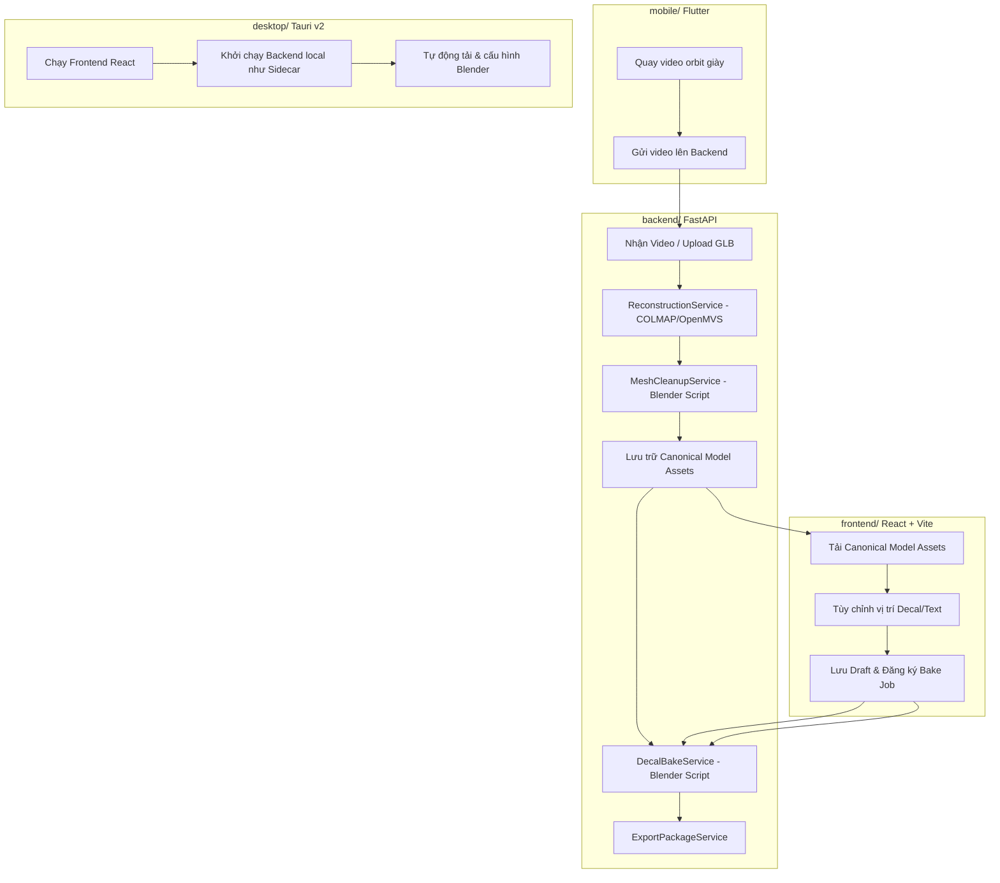

# ar-ai-exe: Báo Cáo Phân Tích Kiến Trúc Hệ Thống

Tài liệu này tổng hợp cấu trúc, luồng hoạt động, các quyết định sản phẩm và quy tắc nghiệp vụ cốt lõi của dự án **ar-ai-exe** (Hệ thống quét, nhập mẫu giày và tùy chỉnh decal/văn bản 3D).

---

## 1. Tổng Quan Hệ Thống (System Architecture)

Dự án được phân chia thành 4 thành phần chính hoạt động độc lập nhưng liên kết chặt chẽ qua các API Endpoint:



---

## 2. Chi Tiết Các Hợp Phần (Subsystems Detail)

### 2.1. Backend (`backend/`)
Được viết bằng **Python (FastAPI)** với cơ sở dữ liệu quan hệ kết hợp hàng đợi **Redis RQ**.

- **Cơ sở dữ liệu (`app/models/entities.py`)**: 
  - Sử dụng SQLAlchemy 2.0 để định nghĩa các thực thể: `User`, `Project`, `ScanSession`, `ModelAsset`, `Design`, `DesignAsset`, `ExportPackage`, `Job`.
  - Quản lý migrate thông qua **Alembic**.
- **Luồng Tái Tạo 3D (`ReconstructionService`)**:
  - Trích xuất khung hình từ video (hỗ trợ orbit góc nghiêng và góc trên) bằng **FFmpeg**.
  - Lọc khung hình dựa trên độ sáng (`reconstruction_min_brightness`), độ nét (`reconstruction_min_sharpness`), và loại bỏ trùng lặp bằng thuật toán băm cảm nhận (**Perceptual Hashing**).
  - Sử dụng **COLMAP** và **OpenMVS** để tái tạo vật thể 3D thô từ ảnh.
- **Chuẩn Hóa Mô Hình (`MeshCleanupService`)**:
  - Thực thi script Blender nền (`editor_ready_cleanup.py`) để loại bỏ các đối tượng phụ, làm sạch hình học thừa, định vị lại tâm vật thể (origin) và tự động thu nhỏ số lượng đa giác (decimate) nếu vượt ngưỡng.
  - Xuất ra gói tài nguyên chuẩn hóa (Canonical Files): `shoe_preview.glb`, `shoe.obj`, `shoe.mtl` và `shoe_texture.png`.
- **Áp Decal 3D (`DecalBakeService`)**:
  - Tạo script Blender nền (`apply_decals.py`) để chiếu bản đồ UV/Decal lên lưới hình học giày.
  - Sử dụng **BVHTree** và kỹ thuật **Raycasting** hai chiều để chiếu đỉnh của lưới decal lên lưới giày thật.

### 2.2. Frontend (`frontend/`)
Sử dụng **React, Vite, TypeScript, TailwindCSS và Three.js** (`@react-three/fiber` & `@react-three/drei`).

- **Quản lý Trạng Thái (`App.tsx`)**:
  - Điều phối trạng thái đăng nhập, chọn dự án, đồng bộ hóa cấu hình thiết kế dạng JSON, và quản lý các công việc chạy ngầm (Bake/Export Jobs).
- **Trình Xem 3D (`ModelViewer.tsx`)**:
  - Hiển thị mô hình giày chuẩn hóa và các decal/text dưới dạng các layer 3D tương tác.
  - Hỗ trợ công cụ Transform (Translate, Rotate, Scale) và cơ chế dính lưới (surface snapping) lên các vùng tùy chỉnh trên giày.
  - Ẩn các layer tạm thời khi mô hình đã được nướng xong (baked preview GLB) để tránh trùng lặp hiển thị.

### 2.3. Desktop App (`desktop/`)
Sử dụng **Tauri v2** đóng gói Frontend React tĩnh và chạy Backend Python như một tiến trình con (Sidecar).

- **Khởi chạy local (`main.rs`)**:
  - Tự động tìm cổng rảnh để khởi chạy ứng dụng phụ FastAPI (`app.desktop_entrypoint` hoặc file thực thi `kusshoes-backend.exe`).
  - Quản lý tải xuống môi trường Blender tự động trên Windows thông qua PowerShell và kiểm tra mã SHA256 tương thích cấu hình từ file `blender.windows.json`.
  - Cung cấp tính năng sao chép nhật ký chẩn đoán và thư mục log nội bộ cho đội ngũ phát triển.

### 2.4. Mobile App (`mobile/`)
Được xây dựng bằng **Flutter**.

- **Chức năng chính**:
  - Quản lý tài khoản và thiết lập thiết bị quét.
  - Ghi hình video giày quay vòng orbit (side orbit & top orbit) và lưu trữ metadata liên quan.
  - Tải video trực tiếp lên máy chủ thông qua Dio HTTP Client với thanh tiến trình trực quan (`backend_api.dart`).

---

## 3. Các Ràng Buộc & Luật Nghiệp Vụ Quan Trọng (Critical Invariants)

> [!IMPORTANT]
> Đây là các quy tắc bất biến cần tuân thủ nghiêm ngặt khi thực hiện bất kỳ chỉnh sửa mã nguồn nào:

1. **Bảo toàn vật liệu giày gốc**: Khi nướng decal (`apply_decals.py`), không được xóa hoặc thay thế các khe vật liệu (material slots) hoặc ánh xạ vân bề mặt (textures) của mô hình giày gốc. Chỉ điều chỉnh các thông số PBR cơ bản (`Base Color`, `Roughness`, `Metallic`) của vật liệu hiện tại nếu chúng không liên kết với một node vân bề mặt (texture node). Tạo vật liệu đơn sắc mới chỉ khi lưới giày không có vật liệu sẵn.
2. **Kiểm Thử Tỷ Lệ Chiếu Decal (Hit Ratio Check)**: Khi chiếu lưới decal lên bề mặt giày trong Blender, tối thiểu **25%** số lượng đỉnh lưới decal phải chiếu trúng bề mặt giày (`hit_ratio >= 0.25`). Nếu không đạt, tác vụ bake sẽ báo lỗi "missed surface error" để tránh decal lơ lửng ngoài không gian.
3. **Giới Hạn Thiết Kế**:
   - Tối đa **50 layer decal** trên một mẫu thiết kế.
   - Giới hạn chiều dài chuỗi văn bản tối đa **80 ký tự**.
   - Dung lượng ảnh decal tải lên tự do tối đa **5 MB**.
   - Định dạng decal phải là Data URI (Base64) hoặc ID tài nguyên đã đăng ký (`assetId`). Không được truyền đường dẫn blob tạm thời của trình duyệt (`blob:...`) lên Backend.
4. **Loại trừ ghi đè vật liệu**: Không áp dụng các thiết lập thuộc tính vật liệu của Frontend lên lưới decal đã nướng (các lưới có tiền tố tên là `decal_`, `svg_decal_`, `text_decal_`).
5. **Tránh lưu bộ nhớ đệm (Cache Busting)**: Do URL mô hình thử nghiệm cố định theo mã thiết kế, Frontend khi tải bản xem trước mới cần sử dụng tham số truy vấn chống lưu đệm (cache-busting query params).

---

## 4. Kiểm Thử & Xác Minh (Verification Commands)

Khi chỉnh sửa bất kỳ phần nào của dự án, hãy chạy bộ lệnh kiểm tra thích hợp:

- **Backend tests & lint**:
  ```powershell
  cd backend
  .\.venv\Scripts\python -m pytest
  .\.venv\Scripts\python -m ruff check .
  ```
- **Frontend build**:
  ```powershell
  cd frontend
  npm run build
  # Cho phiên bản desktop:
  npm run build -- --mode desktop
  ```
- **Desktop package build**:
  ```powershell
  cd desktop
  npm install
  npm run build
  ```

---

> [!NOTE]
> Tài liệu này được biên soạn bởi **Antigravity** dựa trên cấu trúc thư mục thực tế của dự án. Mọi thay đổi về kiến trúc nên được cập nhật trực tiếp tại đây và trong file [CONTEXT.md](file:///D:/Semester%207_SU26/EXE101/Branch%20Mobile/ar-ai-exe/CONTEXT.md).
