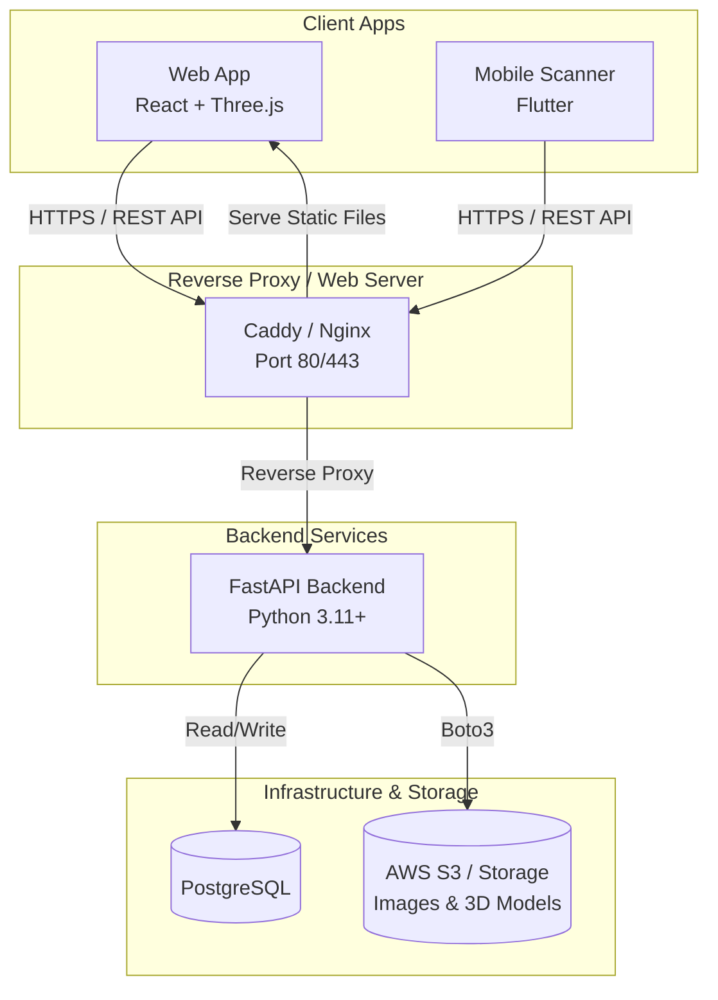

# Shoe Visual Customizer - Technology Stack Overview

This document provides a comprehensive overview of the tools, dependencies, and technologies used across the Shoe Visual Customizer project. It explains the role and purpose of each component within the system architecture.

## System Architecture

The following Mermaid diagram illustrates the high-level architecture of the project and how the different components interact with each other.

---

## 1. Backend (Python / FastAPI)

The backend is built with Python and serves as the core API for both the Web and Mobile clients.

### Core Framework & Server
* **Python (>=3.11)**: The core programming language.
* **uv**: An extremely fast Python package and project manager (replaces pip/poetry).
* **FastAPI (`fastapi`)**: A modern, high-performance web framework for building APIs. Used for routing, request validation, and OpenAPI documentation.
* **Uvicorn (`uvicorn`)**: An ASGI web server implementation for Python. Runs the FastAPI application in production and development.

### Database & ORM
* **PostgreSQL (via `psycopg`)**: The primary relational database used to store user data, shoe configurations, and metadata.
* **SQLAlchemy (`sqlalchemy`)**: The SQL toolkit and Object-Relational Mapper (ORM) for Python. Allows interacting with the database using Python objects.
* **Alembic (`alembic`)**: A lightweight database migration tool for use with SQLAlchemy. Manages schema changes over time.

### Security & Authentication
* **PyJWT (`pyjwt`)**: Used to encode and decode JSON Web Tokens (JWT) for stateless user authentication.
* **Argon2 (`argon2-cffi`)**: The secure password hashing algorithm used to safely store user passwords.

### Cloud & Utilities
* **Boto3 (`boto3`)**: The Amazon Web Services (AWS) SDK for Python. Used to interact with object storage (like AWS S3) for saving and retrieving shoe images and 3D models.
* **Pydantic Settings (`pydantic-settings`)**: Used for robust environment variable parsing and configuration management.
* **Python Multipart (`python-multipart`)**: Required by FastAPI to process form data and file uploads (e.g., uploading shoe textures).

---

## 2. Frontend (Web 3D Customizer)

The web frontend is a Single Page Application (SPA) focused on rendering 3D shoe models and allowing users to customize them in real-time.

### Core Framework & Build Tool
* **TypeScript**: Adds static typing to JavaScript, improving code quality and maintainability.
* **React (`react`, `react-dom`)**: The core UI library used to build the user interface components.
* **Vite (`vite`)**: A lightning-fast frontend build tool and development server.

### 3D Rendering Engine
* **Three.js (`three`)**: A powerful JavaScript 3D library used to render the WebGL graphics.
* **React Three Fiber (`@react-three/fiber`)**: A React reconciler for Three.js. It allows building 3D scenes using declarative React components instead of imperative vanilla JavaScript.
* **React Three Drei (`@react-three/drei`)**: A collection of useful, pre-built helpers and abstractions for `@react-three/fiber` (e.g., camera controls, environment lighting, loading models).

### UI Utilities
* **Lucide React (`lucide-react`)**: A beautiful and consistent icon library used for UI elements.

---

## 3. Mobile (Scanner MVP)

The mobile app serves as a utility for scanning or capturing shoes, built with cross-platform capabilities.

### Core Framework
* **Flutter**: Google's UI toolkit for building natively compiled applications for mobile from a single codebase.
* **Dart**: The programming language used by Flutter.

### Key Dependencies
* **Dio (`dio`)**: A powerful HTTP client for Dart, used to make API requests to the FastAPI backend.
* **Camera (`camera`)**: A Flutter plugin for getting access to the device's cameras. Essential for the "Scanner" functionality to capture shoe images.
* **Flutter Secure Storage (`flutter_secure_storage`)**: Used to securely store sensitive data like JWT authentication tokens in the device's keychain/keystore.
* **URL Launcher (`url_launcher`)**: Used to launch external URLs or web views if needed.
* **Path Provider (`path_provider`)**: Finds commonly used locations on the filesystem (e.g., temp or app data directories) for saving captured images before uploading.

---

## 4. Deployment & DevOps

The project relies on containerization to ensure consistency across development and production environments.

* **Docker & Docker Compose**: Used to containerize the backend and frontend services, making deployment predictable and manageable.
* **Caddy (via `caddy_data` volumes)**: Acts as the web server and reverse proxy. It automatically handles SSL/TLS certificate provisioning (HTTPS) and routes traffic to the appropriate Docker containers.
* **UFW (Uncomplicated Firewall)**: Used on the VPS to manage network security, ensuring only necessary ports (like 80 for HTTP, 443 for HTTPS, and SSH) are exposed to the public internet.
