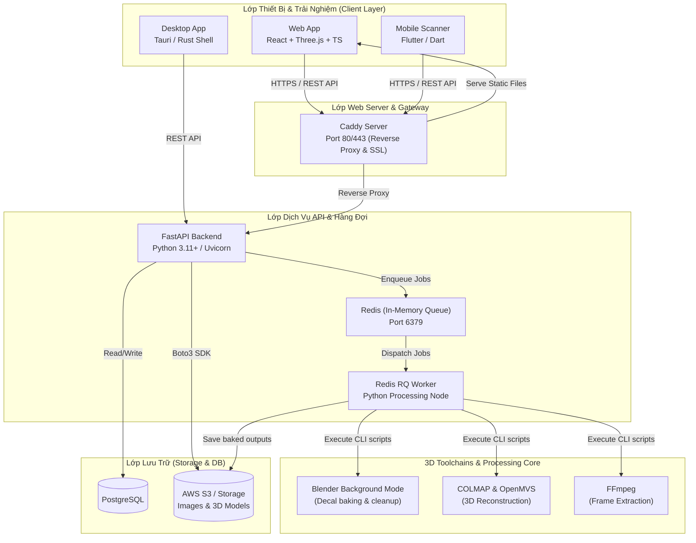

# Shoe Visual Customizer - Technology Stack Overview

Tài liệu này cung cấp một cái nhìn toàn diện về các công cụ, thư viện và công nghệ được sử dụng trong dự án **Shoe Visual Customizer (ar-ai-exe)**. Nó giải thích vai trò, nhiệm vụ của từng thành phần trong kiến trúc hệ thống thực tế.

---

## Sơ Đồ Kiến Trúc Hệ Thống (System Architecture)

Sơ đồ Mermaid dưới đây mô tả kiến trúc cấp cao của dự án và cách các thành phần tương tác bất đồng bộ qua hàng đợi Redis Queue (RQ) để xử lý các tác vụ 3D nặng:

---

## 1. Lớp Backend (Python / FastAPI)

Backend được xây dựng bằng Python, đóng vai trò là API trung tâm tiếp nhận yêu cầu từ Web và Mobile clients, đồng thời quản lý các tác vụ xử lý đồ họa 3D.

### Core Framework & Server
* **Python (>=3.11)**: Ngôn ngữ lập trình cốt lõi của backend.
* **uv**: Trình quản lý package và project Python siêu nhanh (thay thế cho pip/poetry), đồng bộ qua file `uv.lock`.
* **FastAPI**: Web framework hiện đại, hiệu năng cao để xây dựng API, tự động sinh tài liệu Swagger UI.
* **Uvicorn**: ASGI web server chạy ứng dụng FastAPI trong môi trường sản xuất và phát triển.

### Database & ORM
* **PostgreSQL (via `psycopg`)**: Cơ sở dữ liệu quan hệ chính lưu trữ thông tin dự án, người dùng, bản phác thảo thiết kế (Design Drafts) và siêu dữ liệu (Metadata).
* **SQLAlchemy**: Bộ công cụ SQL và Object-Relational Mapper (ORM) giúp tương tác với cơ sở dữ liệu bằng các đối tượng Python.
* **Alembic**: Công cụ quản lý lịch sử và thực thi migrations cấu trúc cơ sở dữ liệu.

### Task Queue & Background Processing
* **Redis**: Cơ sở dữ liệu in-memory dùng làm hàng đợi thông điệp (message queue).
* **RQ (Redis Queue)**: Thư viện quản lý hàng đợi giúp FastAPI đẩy các tác vụ nặng (xử lý video, tái tạo 3D, chiếu decal Blender) cho các tiến trình **RQ Worker** chạy bất đồng bộ trong nền, bảo vệ server API khỏi bị quá tải.

### Cloud Storage & Security
* **Boto3**: AWS SDK cho Python, được sử dụng để lưu trữ các file mô hình 3D (OBJ, GLB, MTL), hình ảnh decal và video quét thô lên AWS S3 hoặc các dịch vụ lưu trữ tương thích S3.
* **PyJWT**: Mã hóa và giải mã JSON Web Token (JWT) phục vụ cơ chế xác thực người dùng không trạng thái (stateless).
* **Argon2 (`argon2-cffi`)**: Giải thuật mã hóa bảo mật mật khẩu người dùng.

---

## 2. Lớp Bộ Lõi Xử Lý 3D (3D Core Pipelines)

Đây là thành phần cốt lõi của dự án nhằm biến dữ liệu quét thô từ thiết bị di động thành các mô hình 3D chuẩn hóa và nướng (bake) thiết kế của người dùng lên giày.

* **Blender (Background Python mode)**:
  * Worker chạy các script Python do server biên soạn (`apply_decals.py`, `decal_baker.py`) trực tiếp trên Blender không giao diện (headless mode).
  * Thực hiện chuẩn hóa gốc tọa độ, căn chỉnh kích thước (normalization), tối giản số lượng đa giác (Mesh Decimation) để tăng tốc độ tải trên web.
  * Thực hiện giải thuật Directional Raycasting (thông qua BVHTree) để chiếu các bản vẽ phẳng decal 2D (sticker/text) lên lưới đa giác 3D của giày và xuất ra file GLB/OBJ/MTL cuối cùng.
* **COLMAP & OpenMVS (3D Reconstruction)**:
  * **COLMAP**: Công cụ Structure-from-Motion (SfM) phân tích chuỗi ảnh từ video quét giày để dựng đám mây điểm thưa (sparse point cloud).
  * **OpenMVS**: Xử lý đám mây điểm chi tiết (dense point cloud), tái tạo lưới đa giác bề mặt (mesh reconstruction) và phủ vật liệu (texturing) để tạo ra file 3D đầu tiên.
* **FFmpeg**: Trích xuất các khung hình chất lượng cao từ video quét giày dựa trên tần suất cấu hình và các bộ lọc loại bỏ khung hình bị mờ hoặc thiếu sáng.

---

## 3. Lớp Frontend Web & Desktop App

Frontend web là ứng dụng Single Page Application (SPA) chuyên biệt cho việc render 3D thời gian thực và tùy chỉnh decal tương tác trực quan.

### Core Framework & Build Tool
* **TypeScript**: Ràng buộc kiểu dữ liệu tĩnh nâng cao độ tin cậy của mã nguồn.
* **React**: Thư viện xây dựng giao diện người dùng theo component.
* **Vite**: Công cụ bundler và dev-server tốc độ cao.

### 3D Rendering Engine (WebGL)
* **Three.js**: Thư viện đồ họa 3D WebGL cốt lõi.
* **React Three Fiber (R3F)**: Trình biên dịch declarative React cho Three.js.
* **React Three Drei**: Bộ công cụ chứa các component trợ năng dựng sẵn cho R3F (Camera controls, lights, model loaders, transform controls).

### Desktop App wrapper
* **Tauri (Rust + Webview)**: Đóng gói mã nguồn React thành ứng dụng Desktop chạy trực tiếp trên máy tính cá nhân của lập trình viên hoặc người vận hành, tối ưu hóa giao tiếp phần cứng cục bộ.

---

## 4. Lớp Mobile App (Scanner MVP)

Ứng dụng di động đóng vai trò là thiết bị đầu cuối thu thập dữ liệu quét thực tế.

* **Flutter (Dart)**: SDK xây dựng ứng dụng di động đa nền tảng (iOS & Android) từ một mã nguồn duy nhất.
* **Dio**: HTTP client kết nối và truyền tải tệp tin dung lượng lớn (video scan) lên API FastAPI.
* **Camera API**: Tích hợp điều khiển phần cứng camera để hướng dẫn người dùng quay quét giày theo đúng góc độ kỹ thuật.
* **Flutter Secure Storage**: Lưu trữ an toàn các thông tin đăng nhập và token JWT dưới dạng keychain/keystore của hệ điều hành.

---

## 5. Triển Khai & Hạ Tầng (Deployment & DevOps)

* **Docker & Docker Compose**: Đóng gói các dịch vụ thành các container cô lập (`web`, `backend`, `worker`, `redis`) giúp đơn giản hóa việc triển khai trên VPS Linux.
* **Caddy Server**: Web server hiệu năng cao đóng vai trò reverse proxy định tuyến HTTPS vào backend/frontend và tự động cấp phát, gia hạn chứng chỉ SSL miễn phí thông qua Let's Encrypt / ACME protocol.
* **UFW (Uncomplicated Firewall)**: Quản lý bảo mật cổng mạng trên VPS, chỉ mở các cổng công khai cần thiết (80, 443) và SSH.

---

## 6. Các Quy Tắc Kỹ Thuật Quan Trọng (Critical Invariants)

* **Bảo toàn vật liệu giày gốc**: Tiến trình Blender bake decal tuyệt đối không xóa hoặc thay thế các slot vật liệu gốc của giày đa nhập khẩu. Chỉ điều chỉnh các thông số PBR cơ bản (`roughness`, `metallic`, `base color`) trên các vật liệu không chứa vân texture liên kết.
* **Tỷ lệ chiếu decal hợp lệ (Raycast Hit Ratio)**: Khi nướng decal lên lưới giày, ít nhất **25%** số đỉnh của lưới decal phải định vị thành công lên bề mặt giày (`hit_ratio >= 0.25`), ngăn ngừa lỗi decal bay lơ lửng ngoài lưới giày.
* **Giới hạn MVP**:
  * Decal tối đa mỗi mẫu giày: **50 layers**.
  * Độ dài 3D text: **Tối đa 80 ký tự**.
  * File sticker tải lên: **Tối đa 5 MB**.
