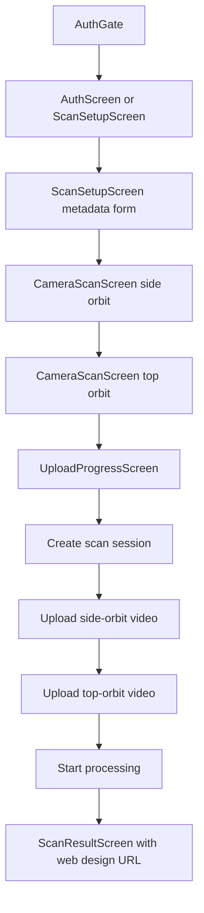
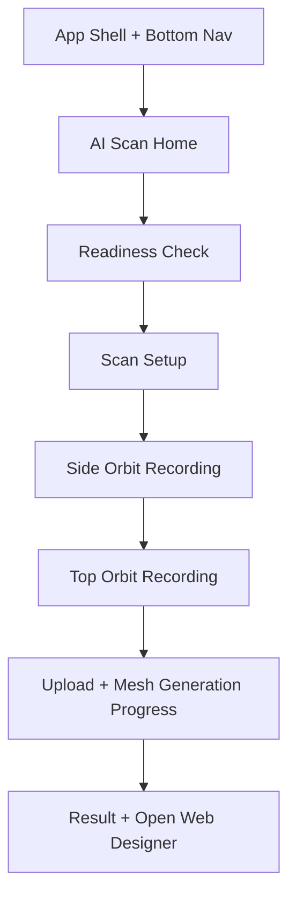

# Mobile Lovable-Inspired Development Plan

## 1. Goal

Develop the existing Flutter mobile app so its scan experience feels closer to the provided Lovable reference: a polished mobile-first shoe scanning flow with a strong brand header, visual scan frame, AI/status indicators, clear primary action, bottom navigation, and a more guided scan-to-web-designer journey.

This plan keeps the current repository boundary intact:

- Continue implementation inside `mobile/` as Flutter/Dart.
- Do not port Lovable's React/Vite/TanStack Router code structure into `mobile/`.
- Use the Lovable project only as UX, feature, and information-architecture inspiration.
- Preserve the backend contract currently used by `mobile/lib/services/backend_api.dart` unless a separate backend change is explicitly planned.

## 2. Reference Summary

The Lovable project appears to be a Vite + React + TypeScript app with:

- `src/routes`: TanStack Router route structure.
- `src/components/ui`: shadcn/Radix-style reusable UI primitives.
- `src/assets/sneaker.jpg`: primary shoe visual.
- `src/hooks`: responsive/theme hooks.
- `src/lib`: utilities, server config, error handling, Lovable reporting.
- `src/router.tsx`: TanStack Router + React Query setup.

The public UI reference communicates these product ideas:

- Brand-forward first screen: `Kus Shoe`.
- Scan step framing: `Step 01 - AI Scan`.
- Hero scan instruction: capture the shoe/foot in 3D with a guided frame.
- Live technical status chips: `Live`, `Depth ON`, `1080p`, `60fps`.
- Strong primary CTA: start AI 3D mesh generation.
- Mobile bottom navigation: Explore, AI Scan, Notify, Profile.

For this repository, wording should be adapted from foot scan to shoe scan, because `CONTEXT.md` defines mobile as a shoe capture/import entry point.

## 3. Current Mobile Structure

Current Flutter files to extend:

- `lib/main.dart`: app entry and auth gate.
- `lib/screens/auth_screen.dart`: login/register/demo login.
- `lib/screens/scan_setup_screen.dart`: metadata form before scanning.
- `lib/screens/camera_scan_screen.dart`: two-pass camera recording flow.
- `lib/screens/upload_progress_screen.dart`: scan session creation, upload, process trigger.
- `lib/screens/scan_result_screen.dart`: result, status, web designer URL.
- `lib/widgets/scan_guide_overlay.dart`: camera overlay frame and scan instruction.
- `lib/services/backend_api.dart`: FastAPI client.
- `lib/models/*`: scan metadata, upload result, readiness DTO.

Current backend-facing flow:



## 4. Product Direction

### 4.1 Target Experience

The mobile app should feel like a guided AI shoe scanner rather than a plain form-driven utility.

Target flow:



### 4.2 UX Principles

- Make `AI Scan` the central first-class mobile tab.
- Keep metadata collection, but make it feel progressive and lightweight.
- Replace text-heavy screens with scan cards, status chips, and guided actions.
- Surface backend readiness before recording/uploading.
- Keep shoe domain language consistent: shoe, sneaker, scan pass, mesh generation, web designer.
- Do not imply real-time reconstruction on device; reconstruction remains backend-owned.

## 5. Proposed Mobile Architecture

### 5.1 New Or Reorganized UI Boundaries

Recommended additions under `mobile/lib/`:

```text
lib/
  app/
    app_shell.dart
    app_theme.dart
  screens/
    scan_home_screen.dart
    scan_setup_screen.dart
    camera_scan_screen.dart
    upload_progress_screen.dart
    scan_result_screen.dart
    auth_screen.dart
  widgets/
    brand_header.dart
    bottom_nav_shell.dart
    scan_status_chips.dart
    scan_hero_card.dart
    scan_guide_overlay.dart
    primary_scan_button.dart
  models/
    scan_metadata.dart
    scan_upload_result.dart
    reconstruction_readiness.dart
  services/
    backend_api.dart
```

This keeps the app Flutter-native while borrowing Lovable's conceptual separation:

- Lovable `routes` -> Flutter `screens`.
- Lovable `components/ui` -> Flutter `widgets`.
- Lovable `hooks/use-mobile` -> Flutter responsive layout via `MediaQuery`/layout widgets.
- Lovable `lib/api` -> existing `BackendApi`.

### 5.2 App Shell

Introduce an app shell after auth with bottom navigation:

- Explore: placeholder or lightweight product/discovery screen.
- AI Scan: primary scan journey.
- Notify: placeholder for scan/reconstruction notifications.
- Profile: logout/account entry.

Initial implementation can make non-scan tabs simple but intentional. The AI Scan tab must be production-functional.

## 6. Feature Plan

### Phase 1 - Visual Foundation

Files likely touched:

- `lib/main.dart`
- `lib/app/app_theme.dart`
- `lib/app/app_shell.dart`
- `lib/widgets/brand_header.dart`
- `lib/widgets/bottom_nav_shell.dart`

Work:

- Extract theme from `main.dart` into `app_theme.dart`.
- Add a darker, premium scan-oriented visual language inspired by Lovable while staying readable.
- Add authenticated app shell with bottom navigation.
- Keep `AuthGate` behavior intact.

Acceptance criteria:

- Logged-out users still see auth.
- Logged-in users land on the AI Scan tab.
- Bottom nav is visible and stable on mobile-sized screens.
- No backend behavior changes.

### Phase 2 - AI Scan Home

Files likely touched/added:

- `lib/screens/scan_home_screen.dart`
- `lib/widgets/scan_hero_card.dart`
- `lib/widgets/scan_status_chips.dart`
- `lib/screens/scan_setup_screen.dart`
- `lib/services/backend_api.dart` if needed only for error handling refinement.

Work:

- Add an AI Scan home screen with:
  - brand/header area,
  - `Step 01 - AI Shoe Scan`,
  - visual scan card,
  - status chips such as `Live capture`, `Guide ON`, `Backend mesh`, `No audio`,
  - CTA to start scan setup,
  - readiness status from `/api/system/reconstruction-readiness`.
- Actually use the existing `getReconstructionReadiness()` method before recording/uploading.
- If backend is not ready, allow user to understand the blocker before spending time recording.

Acceptance criteria:

- Readiness success and failure states are visible.
- CTA behavior is clear for ready/unready backend states.
- Existing scan setup remains reachable.

### Phase 3 - Scan Setup UX Upgrade

Files likely touched:

- `lib/screens/scan_setup_screen.dart`
- possible new widgets for compact metadata fields.

Work:

- Keep all existing metadata fields, but reorganize into grouped sections:
  - Shoe profile,
  - Measurements,
  - Capture environment,
  - Customization intent.
- Reduce visual weight of the form with cards/sections and clearer copy.
- Keep validation for required fields and numeric measurements.
- Keep allowed shoe type values aligned with current project invariant: metadata only, no automatic shoe-type inference.

Acceptance criteria:

- `ScanMetadata.toJson()` output remains compatible with backend.
- Existing dropdown values remain supported.
- User can continue to camera with valid data.

### Phase 4 - Camera Scan Experience

Files likely touched:

- `lib/screens/camera_scan_screen.dart`
- `lib/widgets/scan_guide_overlay.dart`
- `lib/widgets/scan_status_chips.dart`

Work:

- Upgrade overlay to resemble a guided scan interface:
  - stronger scan frame,
  - pass label: Side Orbit / Top-Angle Orbit,
  - timer,
  - capture guidance,
  - status chips.
- Keep actual recording behavior unchanged: two video passes, no audio.
- Improve error and permission messaging.
- Make CTA state clear: Start recording / Stop recording / Continue.

Acceptance criteria:

- Side orbit still routes to top orbit.
- Top orbit still routes to upload progress.
- Timer and pass instructions remain correct.
- Camera errors are user-readable.

### Phase 5 - Upload And Mesh Generation Progress

Files likely touched:

- `lib/screens/upload_progress_screen.dart`
- maybe new progress widgets.

Work:

- Rename UX language from plain upload to scan-to-mesh generation.
- Keep real backend steps unchanged:
  - create scan session,
  - upload side orbit,
  - upload top orbit,
  - start processing.
- Show a stepper/progress timeline inspired by the Lovable `AI mesh generation` concept.
- Preserve retry behavior.

Acceptance criteria:

- Upload flow still calls the same endpoints in the same order.
- Progress is visible per upload pass.
- Failed state has retry.
- Processing status is passed to result screen.

### Phase 6 - Result Screen Upgrade

Files likely touched:

- `lib/screens/scan_result_screen.dart`

Work:

- Make result screen feel like a completion state:
  - scan session ID,
  - reconstruction status,
  - web designer CTA,
  - copy actions,
  - scan another shoe.
- Keep `url_launcher` external browser behavior.
- Make toolchain unavailable state clear and non-scary.

Acceptance criteria:

- User can open web designer URL.
- User can copy scan ID and URL.
- Status labels remain mapped.

## 7. Technical Trade-offs

| Area | Proposed Choice | Benefit | Trade-off / Risk | Mitigation |
|---|---|---|---|---|
| Scalability | Keep Flutter-native screen/widget structure instead of copying React files | Fits current mobile codebase and avoids cross-stack confusion | More manual translation from Lovable UI | Document component mapping in this plan |
| Maintainability | Add small reusable widgets for scan cards, status chips, shell/nav | Reduces repeated UI code across scan screens | Too many tiny widgets can fragment code | Add widgets only when reused or clearly bounded |
| Security | Continue storing native token in `flutter_secure_storage`; avoid exposing secrets in UI/config | Keeps auth boundary aligned with current app | Current `dart:html` import may break native builds | Plan a conditional storage abstraction before Android/iOS release |
| Performance | Keep camera recording and upload behavior unchanged | Minimizes risk in media workflow | More visual UI can add rebuilds | Use stateless widgets and stable layout; avoid unnecessary animations first |
| User Experience | Add scan home, readiness, status chips, bottom nav | Makes app feel closer to Lovable and more guided | Extra screens can slow expert users | Keep CTA path short: AI Scan -> setup -> camera |

## 8. Risks And Open Questions

### Known Risks

- `backend_api.dart` imports `dart:html` directly. This is risky for Android/iOS builds and should be fixed with conditional imports before production mobile release.
- README claims readiness is checked before upload, but current UI does not appear to call `getReconstructionReadiness()`.
- Android `usesCleartextTraffic=true` is suitable for local HTTP testing but should be reviewed for production.
- Non-scan bottom nav tabs must not become fake product promises; keep them minimal or clearly scoped until backend support exists.

### Open Questions Before Implementation

- Should the mobile brand be `Kus Shoe`, or should it use the current product name from this repository?
- Should non-scan tabs be functional now, or simple placeholders for MVP?
- Should an unready backend block scanning entirely, or allow recording and defer upload until backend is ready?
- Should we include a local `sneaker` image asset in Flutter, or design the scan hero using camera/gradient/vector UI only?

## 9. Verification Plan

Run the smallest relevant checks after implementation:

```powershell
cd mobile
flutter analyze
flutter test
```

For Android smoke testing:

```powershell
cd mobile
flutter run --dart-define=BACKEND_BASE_URL=http://10.0.2.2:8000
```

For local Windows/web smoke testing when native device is unavailable:

```powershell
cd mobile
flutter run -d chrome --dart-define=BACKEND_BASE_URL=http://127.0.0.1:8000
```

Expected manual checks:

- Login/demo login reaches authenticated app shell.
- AI Scan tab loads readiness state.
- Scan setup validates metadata.
- Camera flow records side and top orbit.
- Upload progress reaches result screen.
- Result screen opens/copies web designer URL.

## 10. Implementation Order

Recommended order:

1. Add app theme and authenticated app shell.
2. Add AI Scan home screen and readiness state.
3. Upgrade scan setup layout without changing metadata JSON.
4. Upgrade camera overlay and scan controls.
5. Upgrade upload progress UI.
6. Upgrade result screen UI.
7. Fix platform storage abstraction if Android/iOS build fails because of `dart:html`.
8. Run analyze/test and document remaining risks.

## 11. Definition Of Done

The mobile work is complete when:

- The app visually resembles the Lovable reference in scan flow quality and hierarchy.
- The implementation remains Flutter-native and scoped to `mobile/`.
- Existing backend endpoints continue to work.
- The app uses reconstruction readiness in the visible scan journey.
- Core scan/upload/result behavior is covered by focused widget tests where feasible.
- `flutter analyze` and `flutter test` pass, or blockers are documented clearly.
